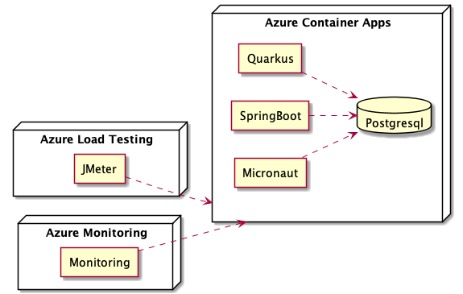

[[welcome]]
= Welcome

This workshop offers attendees an intro-level, hands-on session on Cloud performance using different Java runtimes:
From developing microservices written in Quarkus/SpringBoot/Micronaut, to packaging them in Docker containers, deploy them in Azure Container Apps and monitor the performances.
You will analyze CPU load as well as memory usage.
And then you will establish a baseline, so you can see the impact of scaling out or scaling up containers.

This workshop is a BYOL (_Bring Your Own Laptop_) session, so bring your Windows, OSX, or Linux laptop.
You need JDK {jdk-version} on your machine, Apache Maven ({maven-version}), Docker, Azure CLI and other few tools.
On Mac and Windows, Docker for _x_ is recommended instead of the Docker toolbox setup.

What you are going to do:

* Create your own GitHub Repo based on a GitHub Template
* Develop one microservice that consumes CPU and memory with Quarkus, another one with SpringBoot and Micronaut
* Compile, package and containerize these microservices
* Create an Azure Container Apps environment
* Deploy your containers to Azure Container Apps
* Execute and monitor the microservices using different performance parameters
* Load test the microservices
* Analyze CPU load and scale containers appropriately
* Analyze memory and scale containers appropriately
* And much more!

Ready? Here we go!
Check the workshop at https://azure.github.io/aca-java-runtimes-workshop of flash the QR Code if you don't want to type.

image::../images/qrcode-workshop.png[]

== Presenting the Workshop

xxxxxxx TODO .
xxxxxxx TODO .
xxxxxxx TODO .
xxxxxxx TODO .
xxxxxxx TODO .

=== What Is This Workshop About?

xxxxxxx TODO .
xxxxxxx TODO .
xxxxxxx TODO .
xxxxxxx TODO .
xxxxxxx TODO .

[source,java,indent=0]
----
include::{workshop-github-raw}/quarkus-app/src/main/java/io/containerapps/javaruntime/workshop/quarkus/QuarkusResource.java[tag=adocAlgoCPU]
----

[source,java,indent=0]
----
include::{workshop-github-raw}/quarkus-app/src/main/java/io/containerapps/javaruntime/workshop/quarkus/QuarkusResource.java[tag=adocAlgoMemory]
----

=== What Will You Be Developing?

xxxxxxx TODO .
xxxxxxx TODO .
xxxxxxx TODO .
xxxxxxx TODO .
xxxxxxx TODO .

=== What Will You Be Deploying?

xxxxxxx TODO .
xxxxxxx TODO .
xxxxxxx TODO .
xxxxxxx TODO .
xxxxxxx TODO .

=== How Does This Workshop Work?

You have this material in your hands, and you can now follow it step by step. The structure of this workshop is as follow :

1. _Installing all the needed tools_: in this section, you will install all the tools and code to be able to bundle, package and deploy our application.

2. _Setup Azure resources_: this section introduces Azure and the Container Apps service to prepare all the needed resources for our application. You will create an entire infrastructure on Azure (Container Registry, Postgres database, etc.) to make everything ready for deployment.

3. _Running the Applications Locally_: in this section, you will build Docker images out of our microservices, execute them locally with Docker compose, push them to Azure Registry, all that using Docker and Azure CLI.

4. _Setup CI/CD and deploy application_: in this section, you will setup a CI/CD pipeline using GitHub Actions so that our application builds and deploy automatically on new commits.

5. _Monitoring_: in this section, you will add some load to your microservices, monitor them, scale them, check the logs, etc.

=== What Do You Have to Do?

This workshop should be as self-explanatory as possible. So your job is to follow the instructions by yourself, do what you are supposed to do, and do not hesitate to ask for any clarification or assistance; that's why the team is here.

Oh, and be ready to have some fun!

If you're attending this workshop at Devoxx BE, you can use this link to redeem an Azure Pass: https://azcheck.in/dbe221010.
Once you have your code, copy it and click on the button *Get on board with Azure*, then follow the instructions.

image::../images/qrcode-azure-pass.png[]

== Presenting Azure and Cloud Services

Azure is Microsoft's cloud platform. It provides a wide range of services, from compute to storage, from databases to AI, from IoT to containers, from networking to security, and much more.

For this workshop, we'll use in particular the following services:

- Azure Container Apps: a managed container service to run our microservices.
- Azure Container Registry: a private container registry to store our Docker images.
- Azure Database for PostgreSQL: a managed PostgreSQL database.

=== What's Azure Container Apps?

https://azure.microsoft.com/products/container-apps/[Azure Container Apps] is a fully managed serverless container service on Azure. It allows you to run containerized applications without worrying about orchestration or managing complex infrastructure such as Kubernetes. You write code using your preferred programming language or framework (in this workshop it's Java and Quarkus, but it can be anything), and build microservices with full support for Distributed Application Runtime (https://dapr.io/[Dapr]). Then, your containers will scale dynamically based on HTTP traffic or events powered by Kubernetes Event-Driven Autoscaling (https://keda.sh[KEDA]).

There are already a few compute resources on Azure: from IAAS to FAAS. Azure Container Apps sits between PAAS and FAAS. On one hand, it feels more PaaS, because you are not forced into a specific programming model and you can control the rules on which to scale out / scale in. On the other hand, it has quite some serverless characteristics like scaling to zero, event-driven scaling, per second pricing and the ability to leverage Dapr's event-based bindings.

image::../images/azure-compute-services.png[Diagram showing the different compute resources on Azure]

Container Apps is built on top of Azure Kubernetes Service, including a deep integration with KEDA (event-driven auto scaling for Kubernetes), Dapr (distributed application runtime) and Envoy (a service proxy designed for cloud-native applications). The underlying complexity is completely abstracted for the end-user. So no need to configure your K8S service, deployment, ingress, volume manifests… You get a very simple API and user interface to configure the desired configuration for your containerized application. This simplification means also less control, hence the difference with AKS.

image::../images/azure-container-apps.png[Diagram showing the architecture of Azure Container Apps]

Azure Container Apps has the following features:

- _Revisions_: automatic versioning that helps to manage the application lifecycle of your container apps
- _Traffic control_: split incoming HTTP traffic across multiple revisions for Blue/Green deployments and A/B testing
- _Ingress_: simple HTTPS ingress configuration, without the need to worry about DNS and certificates
- _Autoscaling_: leverage all KEDA-supported scale triggers to scale your app based on external metrics
- _Secrets_: deploy secrets that are securely shared between containers, scale rules and Dapr sidecars
- _Monitoring_: the standard output and error streams are automatically written to Log Analytics
- _Dapr_: through a simple flag, you can enable native Dapr integration for your Container Apps

Azure Container Apps introduces the following concepts:

- _Environment_: this is a secure boundary around a group of Container Apps. They are deployed in the same virtual network, these apps can easily intercommunicate easily with each other and they write logs to the same Log Analytics workspace. An environment can be compared with a Kubernetes namespace.

- _Container App_: this is a group of containers (pod) that is deployed and scale together. They share the same disk space and network.

- _Revision_: this is an immutable snapshot of a Container App. New revisions are automatically created and are valuable for HTTP traffic redirection strategies, such as A/B testing.

image::../images/aca-environment.png[Diagram showing the environment concept in Azure Container Apps]

