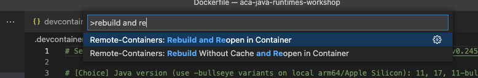
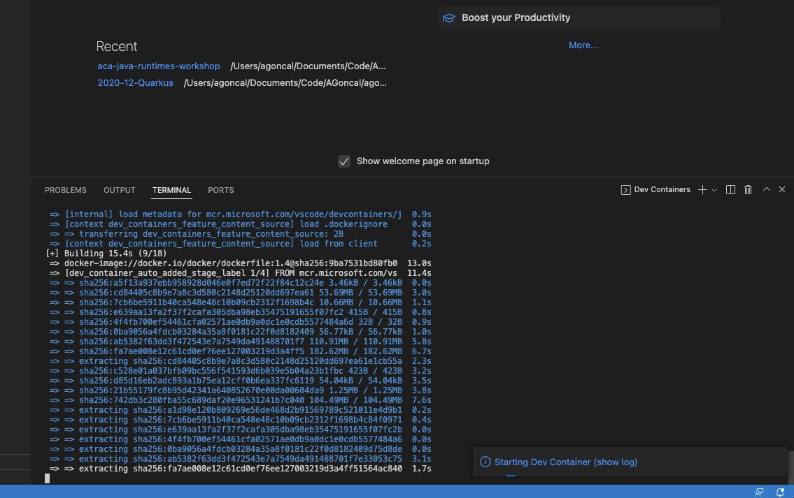

[[setup]]
= Setting Up the Project

Before starting the development, you need to setup the project.
This includes:

* Creating a new project on GitHub based on an existing GitHub template
* Setting up your development environment, either by installing all the needed tools manually, or installing a few tools and relying on VSCode and DevContainers (easier as everything is setup for you).

== Using the GitHub Template

Open {template-github-url}[this GitHub repository,window=_blank] and click on `Use this template`.

image::../images/github-template.png[Screenshot of GitHub showing the "Use this template" button]

You will be redirected to the repository creation page.
Select the owner of the repository, enter a name for your new repository (eg.
`aca-java-runtimes-workshop`), set the repo visibility to `public` and click on `Create repository from template`.

Once the repository is created, clone it locally using git.

1.
Select the **Code** button, then copy your repository url.
+
image::../images/github-clone.png[Screenshot of GitHub showing the repository URL]

2.
Open a terminal and run:
+
[source,shell]
----
git clone <your_repo_url>
----

== Setting Up Your Development Environment Manually

If you decide not to use VSCode and DevContainers, you will need to install the following tools:

[cols="1,1"]
|===
| Java {jdk-version}       | https://learn.microsoft.com/java/openjdk/download[Get OpenJDK]
| Maven {maven-version}    | https://maven.apache.org/download.cgi[Get Maven]
| Docker {docker-version}  |  https://docs.docker.com/get-docker/[Get Docker]
| Azure CLI                | https://learn.microsoft.com/cli/azure/install-azure-cli#install[Get Azure CLI]
| Git                      | https://git-scm.com
| GitHub account           | https://github.com/join
| Azure account            | https://azure.microsoft.com/free/[Get a free Azure account]
| A code editor, such as VS Code, Eclipse, or IntelliJ | https://code.visualstudio.com/Download[Get VS Code]
|===

You can test your installation by running the following commands:

[source,shell]
----
java -version
mvn --version
docker --version
az --version
----

If everything is installed correctly, you should see the version of each tool.

== Setting Up Your VSCode Environment

If you have VS Code and Docker installed on your machine, the quickest way to set up your environment is to use the pre-configured https://code.visualstudio.com/docs/remote/containers[dev container] of the template project.
Install the https://marketplace.visualstudio.com/items?itemName=ms-vscode-remote.vscode-remote-extensionpack[Remote Development extension] in VS Code, and skip to the next section.

TIP: You can learn more about dev containers in https://learn.microsoft.com/shows/beginners-series-to-dev-containers/[this video series].

image::../images/vscode-install.png[Screenshot of the VSCode Marketplace showing the Remote Development extension]

Click on the green *Install* button.
This opens VSCode on the plugin page, ready to install the Remote Development extension.
Click on *Install*
Then, open your project in VSCode.
Open the *Command Palette* (View -> Command Palette) and enter "Rebuild and Reopen in Container".

The first time it will take some time to download and setup the container image, meanwhile you can go ahead and read the next sections.

Once the container is ready, you will see the following message in the bottom right corner of VSCode:

image::../images/vscode-connected.png[]

== Building the Inital Project

No matter if you have installed the tools manually or used the dev container, you can now build the initial project.
Go to the directory where you cloned the repository and build the code with the following Maven command:

[source,shell]
----
cd <your_repo_url>
mvn install
----

You should see the following output:

[source,shell]
----
[INFO] ------------------------------------------------------------------------
[INFO] Reactor Summary:
[INFO]
[INFO] Azure Container Apps and Java Runtimes Workshop 1.0.0-SNAPSHOT SUCCESS
[INFO] Azure Container Apps and Java Runtimes Workshop :: Micronaut 1.0.0-SNAPSHOT SUCCESS
[INFO] Azure Container Apps and Java Runtimes Workshop :: Springboot 1.0.0-SNAPSHOT  SUCCESS
[INFO] Azure Container Apps and Java Runtimes Workshop :: Quarkus 1.0.0-SNAPSHOT SUCCESS
[INFO] ------------------------------------------------------------------------
[INFO] BUILD SUCCESS
[INFO] ------------------------------------------------------------------------
[INFO] Total time:  16.097 s
[INFO] Finished at: 2022-10-07T09:46:16+02:00
[INFO] ------------------------------------------------------------------------
----

== Setting Up Azure

Ok, now that you have the initial project built, let's first setup Azure before starting coding our microservices.

To be able to deploy the application to Azure, you first need an Azure subscription.
If you don't have one, go to https://azure.microsoft.com/free/[azure.microsoft.com/free] and register.

[NOTE]
====
If you're attending this workshop at Devoxx BE, you can use this link to redeem an Azure Pass: {azure-pass-url}.
Once you have your code, copy it and click on the button *Get on board with Azure*, then follow the instructions.
====

Once you have created your Azure subscription, we'll spend some time to create all the resources needed to deploy our Apps.
We'll do that mostly using the Azure CLI, but at any point you can go to https://portal.azure.com[Azure Portal] to have a visual look at the resources we'll be configuring.

First, sign in to your Azure account using the Azure CLI:

[source,shell]
----
az login
----

Make sure you are using the right subscription with:

[source,shell]
----
az account show
----

Now we'll configure the CLI to automatically install extensions when needed.
The Azure CLI is extensible, some commands are part of the core, but others are provided by extensions, such as the `az containerapp` command we'll be using later.

[source,shell]
----
az config set extension.use_dynamic_install=yes_without_prompt
----

== Creating the Azure Resources

We'll create the infrastructure for our application so we can later deploying the microservices to Azure Container Apps.

=== Setting Up the Environment Variables

Let's first set a few environment variables that will help us in creating the Azure infrastructure.

[IMPORTANT]
====
Some resources in Azure need to have a unique name across the globe (for example Azure Registry).
For that, we use the `UNIQUE_IDENTIFIER` environment variable to make sure we don't have any name collision.
If you are developping in your local machine, the `UNIQUE_IDENTIFIER` will be your username (which is not totally unique, but it's a good start).
On the other hand, if you're using the DevContainer, you must manually set this to a unique value (like your name) to avoid conflicts with other users
So, if you use DevContainer, make sure to set the `UNIQUE_IDENTIFIER` environment variable to a unique value.
====

[source,shell]
----
include::{workshop-github-raw}/scripts/infra/azure.sh[tag=adocEnvironmentVariables, indent=0]
----

Now let's create the Azure resources.

=== Resource Group

A https://learn.microsoft.com/azure/azure-resource-manager/management/manage-resource-groups-portal[resource group] is a container that holds related resources for an Azure solution.
The resource group can include all the resources for the solution, or only those resources that you want to manage as a group.
In our workshop, all the databases, all the microservices, etc.
will be grouped into a single resource group.

Run the following command to create the Java Runtimes resource group:

[source,shell]
----
include::{workshop-github-raw}/scripts/infra/azure.sh[tag=adocResourceGroup, indent=0]
----

=== Log Analytics Workspace

https://learn.microsoft.com/azure/azure-monitor/logs/quick-create-workspace?tabs=azure-portal[Log Analytics workspace] is the environment for Azure Monitor log data.
Each workspace has its own data repository and configuration, and data sources and solutions are configured to store their data in a particular workspace.
We will use the same workspace for most of the Azure resources we will be creating.

Create a Log Analytics workspace with the following command:

[source,shell]
----
include::{workshop-github-raw}/scripts/infra/azure.sh[tag=adocLogAnalytics, indent=0]
----

Let's also retrieve the Log Analytics Client ID and client secret and store them in environment variables:

[source,shell]
----
include::{workshop-github-raw}/scripts/infra/azure.sh[tag=adocLogAnalyticsSecrets, indent=0]
----

=== Azure Container Registry

In the next chapters we will be creating Docker containers and pushing them to the Azure Container Registry.
https://azure.microsoft.com/products/container-registry/[Azure Container Registry] is a private registry for hosting container images.
Using the Azure Container Registry, you can store Docker-formatted images for all types of container deployments.

First, let's created an Azure Container Registry with the following command:

[source,shell]
----
include::{workshop-github-raw}/scripts/infra/azure.sh[tag=adocRegistry, indent=0]
----

Update the repository to allow anonymous users to pull the images:

[source,shell]
----
include::{workshop-github-raw}/scripts/infra/azure.sh[tag=adocRegistryUpdate, indent=0]
----

Get the URL of the Azure Container Registry and set it to the `REGISTRY_URL` variable with the following command:

[source,shell]
----
include::{workshop-github-raw}/scripts/infra/azure.sh[tag=adocRegistryShow, indent=0]
----

If you log into the https://portal.azure.com[Azure Portal] and search for the `java-runtimes` resource group, you should see the following created resources.

image::../images/azure-rg.png[Screenshot of Azure Portal showing the Java Runtimes resource group]

=== Creating the Container Apps environment

A container apps environment acts as a boundary for our containers.
Containers deployed on the same environment use the same virtual network and the same Log Analytics workspace.
Create the container apps environment with the following command:

[source,shell]
----
include::{workshop-github-raw}/scripts/infra/azure.sh[tag=adocACAEnv, indent=0]
----

[NOTE]
====
Some Azure CLI commands can take some time to execute.
Don't hesitate to have a look at the next chapters to know what you will have to do.
And then, come back to this one when the command is done and execute the next one.
====

==== Creating the Container Apps

Now that we have created the container apps environment, we can create the container apps.
A container app is a containerized application that is deployed to a container apps environment.
We will create threee container apps, one for each of our Java runtimes.
Since we don't have any container images ready yet, we'll use a default "Hello World" image just get things running.
We'll update the container apps with the actual images later.

[source,shell]
----
include::{workshop-github-raw}/scripts/infra/azure.sh[tag=adocACACreate, indent=0]
----

The `create` command returns the URL for the container apps.
You can also get the URLs with the following commands:

[source,shell]
----
include::{workshop-github-raw}/scripts/infra/deploy.sh[tag=adocIngressHosts, indent=0]
----

Get these locations and copy them into a web browser.
You should see the following page:

image::../images/aca-hello.png[Screenshot of the Hello World page from the Azure Container Apps]

=== Creating the Azure Database for PostgreSQL

We'll use a PostgreSQL database to store analytics data from our microservices.
Because we also want to access these database from an external SQL client, we make them available to the outside world thanks to the `-public all` parameter.

Create the database with the following command (this one will take a few minutes):

[source,shell]
----
include::{workshop-github-raw}/scripts/infra/azure.sh[tag=adocPostgresCreate, indent=0]
----

Now that we have our database setup, it's time to create the tables.
We'll use a database initialization SQL file for that.
Thanks to Azure CLI, we can execute these SQL scripts directly in our newly created database.

Create the tables using the following command (make sure you are in the repository root directory before your execute this command):

[source,shell]
----
include::{workshop-github-raw}/scripts/infra/azure.sh[tag=adocPostgresTable, indent=0]
----

[NOTE]
====
If you get the error `No module named 'psycopg2._psycopg'` that means that some of your Azure CLI dependencies are not correctly installed.
Check https://github.com/Azure/azure-cli/issues/21998 for help.
Try removing the `rdbms-connect` extension (`rm -rf ~/.azure/cliextensions/rdbms-connect`) and reinstalling it again (`az extension add --name rdbms-connect`).
====

You can execute a few SQL statements directly in the database with the following commands to check the content of the three `Statistics` tables (which should be empty at this stage):

[source,shell]
----
include::{workshop-github-raw}/scripts/infra/azure.sh[tag=adocPostgresSelect, indent=0]
----

If you'd like to see the connection string to the database (so you can access your database from an external SQL client), use the following command:

[source,shell]
----
include::{workshop-github-raw}/scripts/infra/azure.sh[tag=adocPostgresConnectionString, indent=0]
----

> **NOTE:**
>
> You need to append `ssl=true&sslmode=require` to the end of each connect string to force the driver to use ssl.

That's it for the Azure infrastructure setup.
Now that we have our Azure Container Apps ready to host our microservices... let's develop our microservices.
