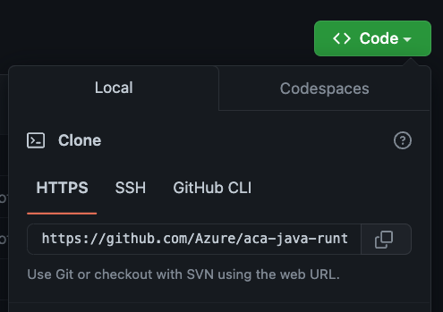

[[setup]]
= Setting Up the Project

Open https://github.com/Azure/aca-java-runtimes-workshop[this GitHub repository] and click on `Use this template`. 

image::../images/github-template.png[Screenshot of GitHub showing the "Use this template" button]

You will be redirected to the repository creation page. Enter a name for your new repository, set the repo visibility to `public` and click on `Create repository from template`.

Once the repository is created, clone it locally using git.

1. Select the **Code** button, then copy your repository url.
+

2. Open a terminal and run:
+
[source,shell]
----
git clone <your_repo_url>
----

If you chose to use the dev container environment, open the project in VS Code, click on the green button in the bottom left corner of the window and select *Reopen in Container*. The first time it will take some time to download and setup the container image, meanwhile you can go ahead and read the next sections.

== Azure and Cloud Services

Azure is Microsoft's cloud platform. It provides a wide range of services, from compute to storage, from databases to AI, from IoT to containers, from networking to security, and much more.

For this workshop, we'll use in particular the following services:

- Azure Container Apps: a managed container service to run our microservices.
- Azure Container Registry: a private container registry to store our Docker images.
- Azure Database for PostgreSQL: a managed PostgreSQL database.

=== What's Azure Container Apps?

https://azure.microsoft.com/products/container-apps/?WT.mc_id=javascript-0000-yolasors[Azure Container Apps] is a fully managed serverless container service on Azure. It allows you to run containerized applications without worrying about orchestration or managing complex infrastructure such as Kubernetes. You write code using your preferred programming language or framework (in this workshop it's Java and Quarkus, but it can be anything), and build microservices with full support for Distributed Application Runtime (https://dapr.io/[Dapr]). Then, your containers will scale dynamically based on HTTP traffic or events powered by Kubernetes Event-Driven Autoscaling (https://keda.sh[KEDA]).

There are already a few compute resources on Azure: from IAAS to FAAS. Azure Container Apps sits between PAAS and FAAS. On one hand, it feels more PaaS, because you are not forced into a specific programming model and you can control the rules on which to scale out / scale in. On the other hand, it has quite some serverless characteristics like scaling to zero, event-driven scaling, per second pricing and the ability to leverage Dapr's event-based bindings.

image::../images/azure-compute-services.png[Diagram showing the different compute resources on Azure]

Container Apps is built on top of Azure Kubernetes Service, including a deep integration with KEDA (event-driven auto scaling for Kubernetes), Dapr (distributed application runtime) and Envoy (a service proxy designed for cloud-native applications). The underlying complexity is completely abstracted for the end-user. So no need to configure your K8S service, deployment, ingress, volume manifests… You get a very simple API and user interface to configure the desired configuration for your containerized application. This simplification means also less control, hence the difference with AKS.

image::../images/azure-container-apps.png[Diagram showing the architecture of Azure Container Apps]

Azure Container Apps has the following features:

- _Revisions_: automatic versioning that helps to manage the application lifecycle of your container apps
- _Traffic control_: split incoming HTTP traffic across multiple revisions for Blue/Green deployments and A/B testing
- _Ingress_: simple HTTPS ingress configuration, without the need to worry about DNS and certificates
- _Autoscaling_: leverage all KEDA-supported scale triggers to scale your app based on external metrics
- _Secrets_: deploy secrets that are securely shared between containers, scale rules and Dapr sidecars
- _Monitoring_: the standard output and error streams are automatically written to Log Analytics
- _Dapr_: through a simple flag, you can enable native Dapr integration for your Container Apps

Azure Container Apps introduces the following concepts:

- _Environment_: this is a secure boundary around a group of Container Apps. They are deployed in the same virtual network, these apps can easily intercommunicate easily with each other and they write logs to the same Log Analytics workspace. An environment can be compared with a Kubernetes namespace.

- _Container App_: this is a group of containers (pod) that is deployed and scale together. They share the same disk space and network.

- _Revision_: this is an immutable snapshot of a Container App. New revisions are automatically created and are valuable for HTTP traffic redirection strategies, such as A/B testing.

image::../images/aca-environment.png[Diagram showing the environment concept in Azure Container Apps]

== Setting Up Azure

To be able to deploy the application to Azure, you first need an Azure subscription. If you don't have one, go to https://azure.microsoft.com/free/?WT.mc_id=javascript-0000-yolasors[https://azure.microsoft.com/free] and register.

[NOTE]
====
If you're attending this workshop at Devoxx BE, you can use this link to redeem an Azure Pass: https://azcheck.in/dbe221010.
Once you have your code, copy it and click on the button *Get on board with Azure*, then follow the instructions.
====

Once you have created your Azure subscription, we'll spend some time to create all the resources needed to deploy our Apps. We'll do that mostly using the Azure CLI, but at any point you can go to https://portal.azure.com?WT.mc_id=javascript-0000-yolasors[Azure Portal] to have a visual look at the resources we'll be configuring.

First, sign in to your Azure account using the Azure CLI:

[source,shell]
----
az login
----

Make sure you are using the right subscription with:

[source,shell]
----
az account show
----

Now we'll configure the CLI to automatically install extensions when needed. The Azure CLI is extensible, some commands are part of the core, but others are provided by extensions, such as the `az containerapp` command we'll be using later.

[source,shell]
----
az config set extension.use_dynamic_install=yes_without_prompt
----

== Creating the Azure Resources

We'll create the infrastructure for our application so we can later deploying the microservices to Azure Container Apps.

=== Setting Up the Environment Variables

Let's first set a few environment variables that will help us in creating the Azure infrastructure.

[source,shell]
----
include::../../../../../scripts/infra/azure.sh[lines=65..88, indent=0]
----

Now let's create the Azure resources.

=== Resource Group

A https://learn.microsoft.com/azure/azure-resource-manager/management/manage-resource-groups-portal?WT.mc_id=javascript-0000-yolasors[resource group] is a container that holds related resources for an Azure solution. The resource group can include all the resources for the solution, or only those resources that you want to manage as a group. In our workshop, all the databases, all the microservices, etc. will be grouped into a single resource group.

Run the following command to create the Java Runtimes resource group:

[source,shell]
----
include::../../../../../scripts/infra/azure.sh[lines=90..93, indent=0]
----

=== Log Analytics Workspace

https://learn.microsoft.com/azure/azure-monitor/logs/quick-create-workspace?tabs=azure-portal&WT.mc_id=javascript-0000-yolasors[Log Analytics workspace] is the environment for Azure Monitor log data. Each workspace has its own data repository and configuration, and data sources and solutions are configured to store their data in a particular workspace. We will use the same workspace for most of the Azure resources we will be creating.

Create a Log Analytics workspace with the following command:

[source,shell]
----
include::../../../../../scripts/infra/azure.sh[lines=97..101, indent=0]
----

Let's also retrieve the Log Analytics Client ID and client secret and store them in environment variables:

[source,shell]
----
include::../../../../../scripts/infra/azure.sh[lines=103..117, indent=0]
----

=== Azure Container Registry

In the next chapters we will be creating Docker containers and pushing them to the Azure Container Registry. https://azure.microsoft.com/products/container-registry/?WT.mc_id=javascript-0000-yolasors[Azure Container Registry] is a private registry for hosting container images. Using the Azure Container Registry, you can store Docker-formatted images for all types of container deployments.

First, let's created an Azure Container Registry with the following command:

[source,shell]
----
include::../../../../../scripts/infra/azure.sh[lines=119..126, indent=0]
----

Update the repository to allow anonymous users to pull the images:

[source,shell]
----
include::../../../../../scripts/infra/azure.sh[lines=128..131, indent=0]
----

Get the URL of the Azure Container Registry and set it to the REGISTRY_URL variable with the following command:

[source,shell]
----
include::../../../../../scripts/infra/azure.sh[lines=133..139, indent=0]
----

If you log into the https://portal.azure.com?WT.mc_id=javascript-0000-yolasors[Azure Portal] and search for the "java-runtimes" resource group, you should see the following created resources.

image::../images/azure-rg.png[Screenshot of Azure Portal showing the Java Runtimes resource group]

=== Creating the Container Apps environment

A container apps environment acts as a boundary for our containers. Containers deployed on the same environment use the same virtual network and the same Log Analytics workspace. Create the container apps environment with the following command:

[source,shell]
----
include::../../../../../scripts/infra/azure.sh[lines=141..147, indent=0]
----

==== Creating the Container Apps

Now that we have created the container apps environment, we can create the container apps. A container app is a containerized application that is deployed to a container apps environment. We will create threee container apps, one for each of our Java runtimes. Since we don't have any container images ready yet, we'll use a default "Hello World" image just get things running. We'll update the container apps with the actual images later.

[source,shell]
----
include::../../../../../scripts/infra/azure.sh[lines=149..182, indent=0]
----

// TODO: other apps!

The `create` command returns the URL for the container apps. Copy this location to a web browser, and you should see the following page:

image::../images/aca-hello.png[Screenshot of the Hello World page from the Azure Container Apps]

=== Creating the Azure Database for PostgreSQL

We'll use a PostgreSQL database to store analytics data from our microservices. Because we also want to access these database from an external SQL client, we make them available to the outside world thanks to the `-public all` parameter.

Create the database with the following command (this one will take a few minutes):

[source,shell]
----
include::../../../../../scripts/infra/azure.sh[lines=184..195, indent=0]
----

Then we create the database schema:

[source,shell]
----
include::../../../../../scripts/infra/azure.sh[lines=197..200, indent=0]
----

Now that we have our database setup, it's time to create the tables. We'll use a database initialization SQL file for that. Thanks to Azure CLI, we can execute these SQL scripts directly in our newly created database.

Create the tables using the following command (make sure you are in the repository root directory before your execute this command):

[source,shell]
----
include::../../../../../scripts/infra/azure.sh[lines=203..208, indent=0]
----

[NOTE]
====
If you get the error `No module named 'psycopg2._psycopg'` that means that some of your Azure CLI dependencies are not correctly installed. Check https://github.com/Azure/azure-cli/issues/21998 for help.
====
