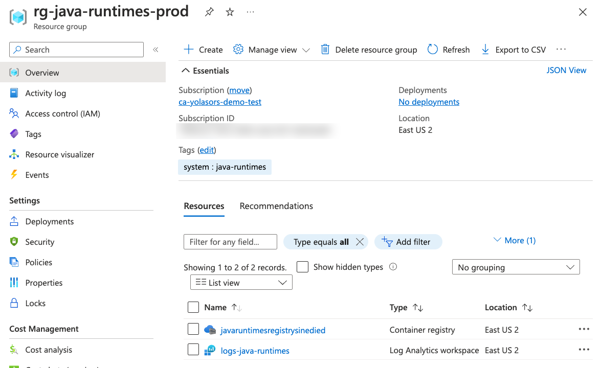
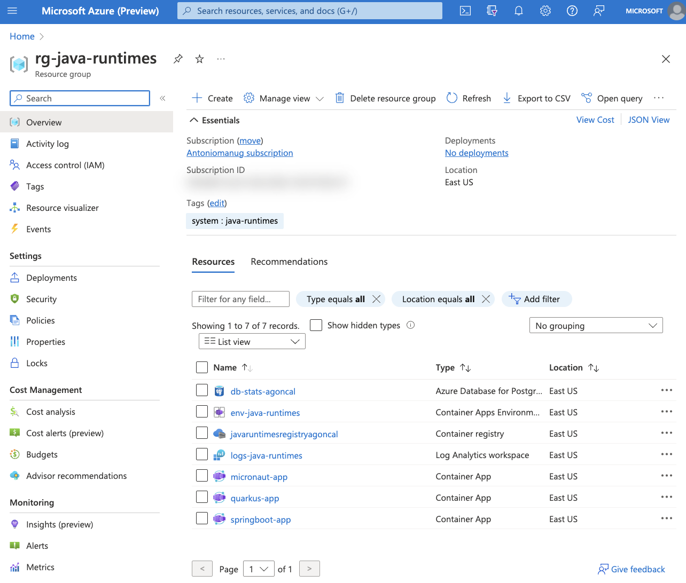

[[setup-azure]]
= Setting Up the Azure Container Apps Environment

Ok, now that you have the three microservices up and running, time to deploy them on Azure Container Apps.
But before, you need an Azure subscription, and then you have to set up the Azure environment.

== Getting an Azure Subscription

To be able to deploy the application to Azure, you first need an Azure subscription.
If you don't have one, go to https://azure.microsoft.com/free/[azure.microsoft.com/free] and register.

[NOTE]
====
If you're attending this workshop at Devoxx FR, you can use this link to redeem an Azure Pass: {azure-pass-url}.
Once you have your code, copy it and click on the button *Get on board with Azure*, then follow the instructions.
====

Once you have created your Azure subscription, let's use a few Azure CLI commands to login and make sure you are using the right subscription.
Also remember that, at any point, you can go to the https://portal.azure.com[Azure Portal] to have a visual look at the resources we'll be configuring.

First, sign in to your Azure account using the Azure CLI:

[source,shell]
----
az login
----

[NOTE]
====
If you're using GitHub Codespaces, you should login using the following command:

[source,shell]
----
az login --use-device-code
----
====

Make sure you are using the right subscription with:

[source,shell]
----
az account show
----

[NOTE]
====
If you have several Azure subscription, make sure you are using the right one.
For that, you can execute the following command to list all your subscriptions and set the one you want to use:

[source,shell]
----
az account list --output table
az account set --subscription <subscription-id>
----
====

Now we'll configure the CLI to automatically install extensions when needed, and allow the different resource providers to be used in your subscription.
The Azure CLI is extensible, some commands are part of the core, but others are provided by extensions, such as the `az containerapp` command we'll be using later.

[source,shell]
----
include::{project-root}/scripts/infra/azure.sh[tag=adocSetupAzCli, indent=0]
----

== Creating the Azure Resources

Now, let's create the infrastructure for our application, so we can later deploy our microservices to Azure Container Apps.

[WARNING]
====
Azure Container Apps is not available in all the regions.
To make sure you can follow this workshop, check if the region you are in supports Azure Container Apps by executing the following command

[source,shell]
----
az provider show -n Microsoft.App --query "resourceTypes[?resourceType=='managedEnvironments'].locations"
----
====

=== Setting Up the Environment Variables

Let's first set a few environment variables that will help us in creating the Azure infrastructure.

[IMPORTANT]
====
Some resources in Azure need to have a unique name across the globe (for example Azure Registry or Azure Load Testing).
For that, we use the `UNIQUE_IDENTIFIER` environment variable to make sure we don't have any name collision.
If you are developing in your local machine, the `UNIQUE_IDENTIFIER` will be your username (which is not totally unique, but it's a good start).
On the other hand, if you're using the Dev Containers, you must manually set this to a unique value (like your name) to avoid conflicts with other users
So, if you use Dev Containers, make sure to set the `UNIQUE_IDENTIFIER` environment variable to a unique value.
Please make sure to use a lowercase value, as it's used as a suffix to create resources that cannot stand uppercase.
====

[source,shell]
----
include::{project-root}/scripts/infra/azure.sh[tag=adocEnvironmentVariables, indent=0]
----

[NOTE]
====
Notice that we are using a specific location.
This means that all the Azure resources that we are creating will be created in the same location.
Depending on your geographical location, the resources might be created in different datacenters closer to you.
If you want to know the list of available locations, you can execute the following command:

[source,shell]
----
az account list-locations --query "[].name"
----

====

[TIP]
====
If you use multiple terminal or if you get interrupted during the workshop, you can use a script to re-set all the environment variables in your current shell:

[source,shell]
----
source ./scripts/infra/env.sh
----

If you need to force a specific `UNIQUE_IDENTIFIER`, you can set it before running the command with `export UNIQUE_IDENTIFIER=<your-unique-identifier>`.
====

Now let's create the Azure resources.

=== Resource Group

A https://learn.microsoft.com/azure/azure-resource-manager/management/manage-resource-groups-portal[resource group] is a container that holds related resources for an Azure solution.
The resource group can include all the resources for the solution, or only those resources that you want to manage as a group.
In our workshop, all the databases, all the microservices, etc.
will be grouped into a single resource group.

Run the following command to create the Java Runtimes resource group:

[source,shell]
----
include::{project-root}/scripts/infra/azure.sh[tag=adocResourceGroup, indent=0]
----

=== Log Analytics Workspace

https://learn.microsoft.com/azure/azure-monitor/logs/quick-create-workspace?tabs=azure-portal[Log Analytics workspace] is the environment for Azure Monitor log data.
Each workspace has its own data repository and configuration, and data sources and solutions are configured to store their data in a particular workspace.
We will use the same workspace for most of the Azure resources we will be creating.

Create a Log Analytics workspace with the following command:

[source,shell]
----
include::{project-root}/scripts/infra/azure.sh[tag=adocLogAnalytics, indent=0]
----

Let's also retrieve the Log Analytics Client ID and client secret and store them in environment variables:

[source,shell]
----
include::{project-root}/scripts/infra/azure.sh[tag=adocLogAnalyticsSecrets, indent=0]
----

=== Azure Container Registry

In the next chapter we will be creating Docker containers and pushing them to the Azure Container Registry.
https://azure.microsoft.com/products/container-registry/[Azure Container Registry] is a private registry for hosting container images.
Using the Azure Container Registry, you can store Docker-formatted images for all types of container deployments.

First, let's created an Azure Container Registry with the following command (notice that we create the registry with admin rights `--admin-enabled true` which is not suited for real production, but good for our workshop):

[source,shell]
----
include::{project-root}/scripts/infra/azure.sh[tag=adocRegistry, indent=0]
----

Update the repository to allow anonymous users to pull the images (this can be handy if you want other attendees to use your registry):

[source,shell]
----
include::{project-root}/scripts/infra/azure.sh[tag=adocRegistryUpdate, indent=0]
----

Get the URL of the Azure Container Registry and set it to the `REGISTRY_URL` variable with the following command:

[source,shell]
----
include::{project-root}/scripts/infra/azure.sh[tag=adocRegistryShow, indent=0]
----

If you log into the https://portal.azure.com[Azure Portal] and search for the `rg-java-runtimes` resource group, you should see the following created resources.

=== Creating the Container Apps environment

A container apps environment acts as a boundary for our containers.
Containers deployed on the same environment use the same virtual network and the same Log Analytics workspace.
Create the container apps environment with the following command:

[source,shell]
----
include::{project-root}/scripts/infra/azure.sh[tag=adocACAEnv, indent=0]
----

[NOTE]
====
Some Azure CLI commands can take some time to execute.
Don't hesitate to have a look at the next chapters to know what you will have to do.
And then, come back to this one when the command is done and execute the next one.
====

==== Creating the Container Apps

Now that we have created the container apps environment, we can create the container apps.
A container app is a containerized application that is deployed to a container apps environment.
We will create three container apps, one for each of our Java runtimes (Quarkus, Micronaut and Spring Boot).
Since we don't have any container images ready yet, we'll use a default "_Hello World_" image just to get things running.
We'll update the container apps with the actual images later.

[source,shell]
----
include::{project-root}/scripts/infra/azure.sh[tag=adocACACreate, indent=0]
----

The `create` command returns the URL for the container apps.
You can also get the URLs with the following commands:

[source,shell]
----
include::{project-root}/scripts/infra/deploy.sh[tag=adocIngressHosts, indent=0]
----

Get these locations and copy them into a web browser.
You should see the following page:

image::../assets/aca-hello.png[Screenshot of the Hello World page from the Azure Container Apps]

=== Creating the Azure Database for PostgreSQL

We'll use a PostgreSQL database to store analytics data from our microservices.
Because we also want to access these database from an external SQL client, we make them available to the outside world thanks to the `-public all` parameter.

Create the database with the following command (this one will take a few minutes):

[source,shell]
----
include::{project-root}/scripts/infra/azure.sh[tag=adocPostgresCreate, indent=0]
----

At this stage, if you go back to the http://portal.azure.com[Azure Portal] you'll see the database deployed as well as the 3 container apps.

Now that we have our database setup, it's time to create the tables.
We'll use a database initialization SQL file for that.
Thanks to Azure CLI, we can execute these SQL scripts directly in our newly created database.

Create the tables using the following command (make sure you are in the repository root directory before your execute this command):

[source,shell]
----
include::{project-root}/scripts/infra/azure.sh[tag=adocPostgresTable, indent=0]
----

[NOTE]
====
If you get the error `No module named 'psycopg2._psycopg'` that means that some of your Azure CLI dependencies are not correctly installed.
Check https://github.com/Azure/azure-cli/issues/21998 for help.
Try removing the `rdbms-connect` extension (`rm -rf ~/.azure/cliextensions/rdbms-connect`) and reinstalling it again (`az extension add --name rdbms-connect`).
====

You can execute a few SQL statements directly in the database with the following commands to check the content of the three `Statistics` tables (which should be empty at this stage):

[source,shell]
----
include::{project-root}/scripts/infra/azure.sh[tag=adocPostgresSelect, indent=0]
----

If you'd like to see the connection string to the database (so you can access your database from an external SQL client), use the following command:

[source,shell]
----
include::{project-root}/scripts/infra/azure.sh[tag=adocPostgresConnectionString, indent=0]
----

[NOTE]
====
You need to append `ssl=true&sslmode=require` to the end of each connect string to force the driver to use ssl.
====

That's it for the Azure infrastructure setup.
Now that we have our Azure Container Apps ready to host our microservices...
let's containerize and deploy our microservices.
