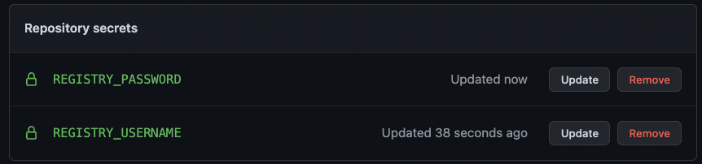
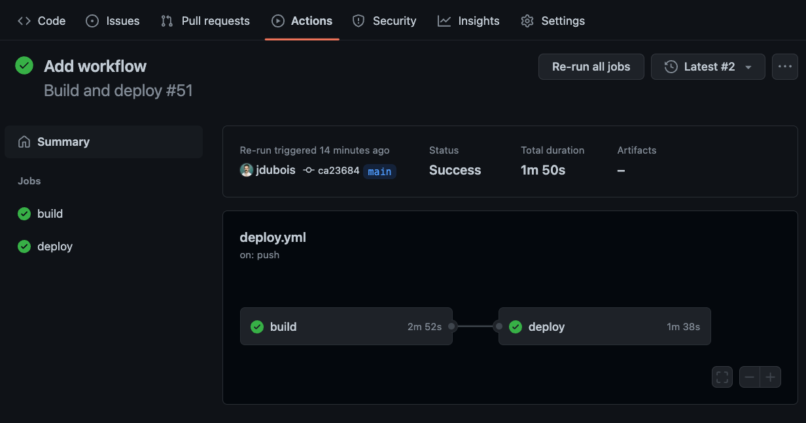

[[deploy]]
= Deploying the Applications

Now that all our microservices are completed, we need to deploy them to Azure Container Apps.
To do this, we'll setup a GitHub Actions CI/CD workflow that will build and deploy our application to Azure Container Apps whenever we push new commits to the main branch of our repository.

== What's CI/CD?

CI/CD stands for _Continuous Integration_ and _Continuous Delivery_.

Continuous Integration is a software development practice that requires developers to integrate code into a shared repository several times a day.
Each integration can then be verified by an automated build and automated tests.
By doing so, you can detect errors quickly, and locate them more easily.

Continuous Delivery pushes this practice further, by preparing for a release to production after each successful build.
By doing so, you can get working software into the hands of users faster.

== What's GitHub Actions?

https://github.com/features/actions[GitHub Actions] is a service that lets you automate your software development workflows.
It allows you to run workflows that can be triggered by any event on the GitHub platform, such as opening a pull request or pushing a commit to a repository.

It's a great way to automate your CI/CD pipelines, and it's free for public repositories.

== Setting Up GitHub Actions for deployment

To set up GitHub Actions for deployment, we'll need to create a new workflow file in our repository.
This file will contain the instructions for our CI/CD pipeline.

Create a new file in your repository with the path `.github/workflows/deploy.yml` and the following content:

[source,yaml]
----
include::{workshop-github-raw}/.github/workflows/deploy.yml[tags=adocGitHubActionsWorkflowBase;!adocSkipPath]
----

[WARNING]
====
Don't forget to replace the value of the `REGISTRY_URL` environment variable with the value of the `$REGISTRY_URL` variable that you copied earlier.
You use the command `echo $REGISTRY_URL` to get the value of the variable.
====

This workflow will be triggered every time a commit is pushed to the `main` branch.
It will then run a `build` job the following steps:

- Checkout the code from the repository
- Set up Java environment
- Set up https://docs.docker.com/engine/reference/commandline/buildx[Docker Buildx] for building our images
- Log in to our container registry

=== Building the applications

Now we need to add the steps to build and package our apps.
Note that our tests will be run as part of the build, to make sure the integration is correct.
Add the following step to the `build` job:

[source,yaml]
----
include::{workshop-github-raw}/.github/workflows/deploy.yml[tag=adocBuild]
----

[WARNING]
Make sure to keep the correct indentation for the steps.
YAML is very sensitive to indentation.

[TIP]
====
If earlier you skipped some sections and have some microservices variants that you did not prepare, you can use some of these pre-built Docker images at the deployment step, and remove the next Docker build/push steps that you do not need:

[source,text,indent=0]
----
ghcr.io/azure/aca-java-runtimes-workshop/quarkus-app:latest
ghcr.io/azure/aca-java-runtimes-workshop/micronaut-app:latest
ghcr.io/azure/aca-java-runtimes-workshop/springboot-app:latest
ghcr.io/azure/aca-java-runtimes-workshop/quarkus-app-native:latest
ghcr.io/azure/aca-java-runtimes-workshop/micronaut-app-native:latest
ghcr.io/azure/aca-java-runtimes-workshop/springboot-app-native:latest
----
====

The next step is to build our Docker images.
We'll use the https://github.com/marketplace/actions/build-and-push-docker-images[`docker/build-push-action` action] to build and push our images to our container registry.
Add the following steps to the `build` job:

[source,yaml]
----
include::{workshop-github-raw}/.github/workflows/deploy.yml[tag=adocPush]
----

We're using the `github.sha` variable, to tag our images with the commit SHA that triggered the workflow.
This way, we can easily identify which version of the application is deployed.

[TIP]
====
Here we're building and pushing our images sequentially to keep things simple, but you could also create three separate `build` jobs, one for each image, to run them in parallel which would be faster.
====

=== Deploying to Azure Container Apps

Our container images are now built and pushed to our container registry, ready to be deployed.
We'll add a new `deploy` job to our workflow to deploy them to Azure Container Apps.
Add these lines after the `build` job:

[source,yaml]
----
include::{workshop-github-raw}/.github/workflows/deploy.yml[tag=adocDeploy]
----

This job will run after the `build` job, and will use the Azure CLI to deploy our apps to Azure Container Apps.
We're using the `github.sha` variable again to make sure we're deploying the correct version of the images.

=== Setting up secrets

As you can see in the previous steps, we're using differents secrets in our workflow: `REGISTRY_USERNAME`, `REGISTRY_PASSWORD` and `AZURE_CREDENTIALS`.
https://docs.github.com/en/actions/security-guides/encrypted-secrets[Secrets] in GitHub are encryped and allow you to store sensitive information such as passwords or API keys, and use them in your workflows using the `${{ secrets.MY_SECRET }}` syntax.

In GitHub, secrets can be defined at three different levels:

- _Repository level_: secrets defined at the repository level are available in all workflows of the repository.
- _Organization level_: secrets defined at the organization level are available in all workflows of the https://docs.github.com/en/organizations/collaborating-with-groups-in-organizations/about-organizations[GitHub organization].
- _Environment level_: secrets defined at the environment level are available only in workflows referencing the specified https://docs.github.com/en/actions/deployment/targeting-different-environments/using-environments-for-deployment[environment].

For this workshop, we'll define our secrets at the repository level.
To do so, go to the `Settings` tab of your repository, and select `Secrets and variables` then `Actions` under it, in the left menu.

Then select `New repository secret` and create two secrets for `REGISTRY_USERNAME` and `REGISTRY_PASSWORD`.

image::../assets/github-secrets.png[Screenshot of GitHub interface showing the New repository secret button]

You can get the value of the `REGISTRY_USERNAME` and `REGISTRY_PASSWORD` secrets by running the following commands:

[source,shell]
----
include::{workshop-github-raw}/scripts/infra/deploy.sh[tag=adocRegistryCredentials, indent=0]
----

You will end up with something like this:

[TIP]
====
You can also use the https://cli.github.com[GitHub CLI] to define your secrets, using the command `gh secret set <MY_SECRET> -b"<SECRET_VALUE>" -R <repository_url>`.
====

==== Creating an Azure Service Principal

In order to deploy our application to Azure Container Apps, we'll need to create an Azure Service Principal.
This is an identity that can be used to authenticate to Azure, and that can be granted access to specific resources.

To create a new Service Principal, run the following commands:

[source,shell]
----
include::{workshop-github-raw}/scripts/infra/azure.sh[tag=adocCreatePrincipal, indent=0]
----

Then just like in the previous step, create a new secret in your repository named `AZURE_CREDENTIALS` and paste the value of the `AZURE_CREDENTIALS` variable as the secret value (make sure to *copy the entire JSon*).

image::../assets/github-secrets-added-2.png[Screenshot of GitHub interface showing the added secrets]

=== Updating the Container Apps target port

Earlier, we used a test image when we created our Container Apps instance as we didn't have our application images ready yet.
The test image use port `80` in the container, but we use a different port in each of our applications so we have to update it before deployment.

Run the following commands to update the target ports:

[source,shell]
----
include::{workshop-github-raw}/scripts/infra/deploy.sh[tag=adocIngressUpdate, indent=0]
----

If you want you can have a look at the https://portal.azure.com[Azure portal] to check that the target port has been updated.

image::../assets/portal-update-port.png[Screenshot of Azure Portal showing the updated target port]

=== Running the workflow

Now that we've defined our workflow and prepared everything, we can run it to deploy our application to Azure Container Apps.
Commit and push your changes to your repository, and go to the `Actions` tab of your repository to see the workflow running.
It should take a few minutes to complete.

[WARNING]
====
If during deployment, you get an error that looks like this:

[source,shell]
----
ERROR: (WebhookInvalidParameterValue) The following field(s) are either invalid or missing. Invalid value: "javaruntimesregistry....": GET https:?scope=repository....azurecr.io: UNAUTHORIZED: authentication required.
----

It's because you didn't allow anonymous pull to the container registry.
Make sure you have executed the following command:

[source,shell]
----
include::{workshop-github-raw}/scripts/infra/azure.sh[tag=adocRegistryUpdate, indent=0]
----
====

If you want, you can check the Registry in the https://portal.azure.com[Azure portal].
You will see that the images have been pushed to the registry.
You can even check the content of the images by clicking on the `Tags` tab.

image::../assets/portal-registry.png[Screenshot of Azure Portal showing the container registry]

=== Testing the deployed application

Once your workflow is completed, let's make a quick test on our deployed apps.
First we need to get the ingress URL by running the following command:

[source,shell]
----
include::{workshop-github-raw}/scripts/infra/deploy.sh[tag=adocIngressHosts, indent=0]
----

Then we can use `curl` to test our three applications.
The first invocation can take long as Azure Container Apps needs to scale from 0.
But then, the following `curl` invocations should be faster.

[source,shell]
----
include::{workshop-github-raw}/scripts/infra/scale.sh[tag=adocPingApps, indent=0]
----

If you want to quickly check the logs of the applications, you can use the following Azure CLI commands (more on logs later):

[source,shell]
----
az containerapp logs show \
   --name "$QUARKUS_APP" \
   --resource-group "$RESOURCE_GROUP" \
   --format text

az containerapp logs show \
   --name "$MICRONAUT_APP" \
   --resource-group "$RESOURCE_GROUP" \
   --format text

az containerapp logs show \
   --name "$SPRING_APP" \
   --resource-group "$RESOURCE_GROUP" \
   --format text
----
