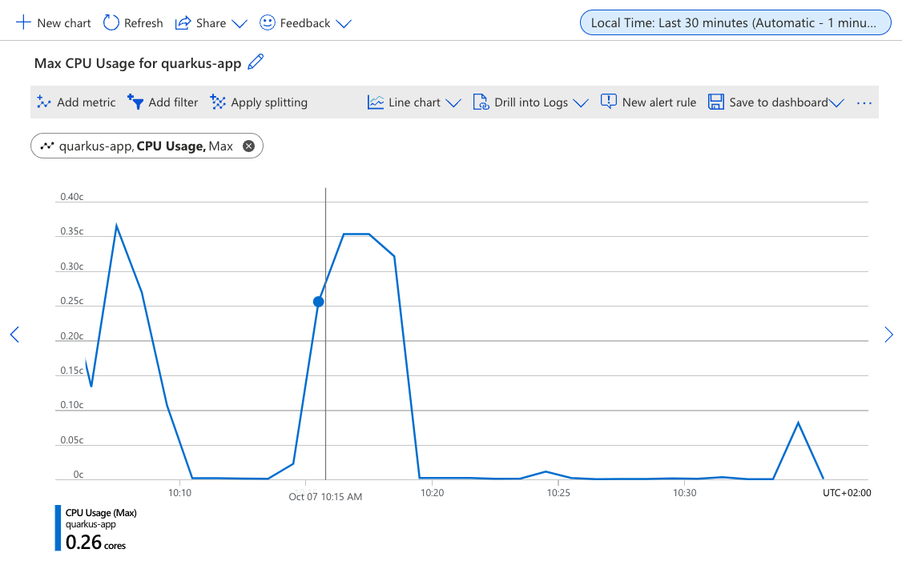
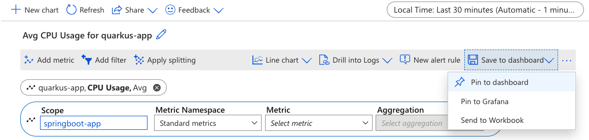
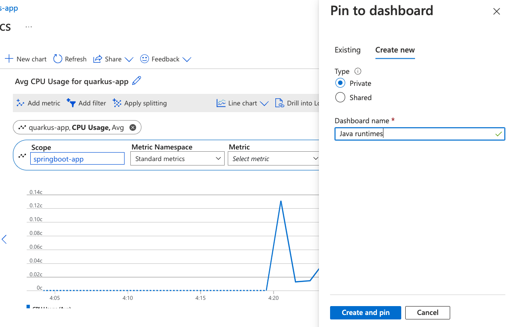
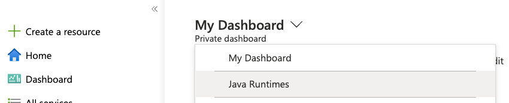
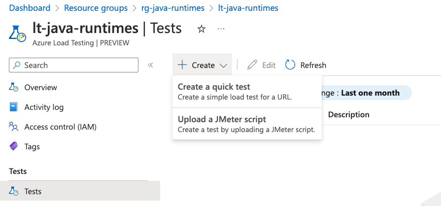
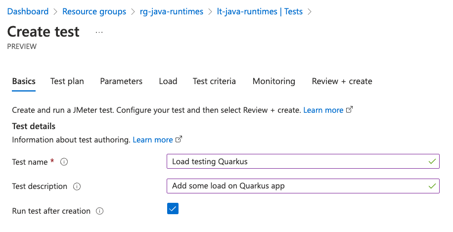
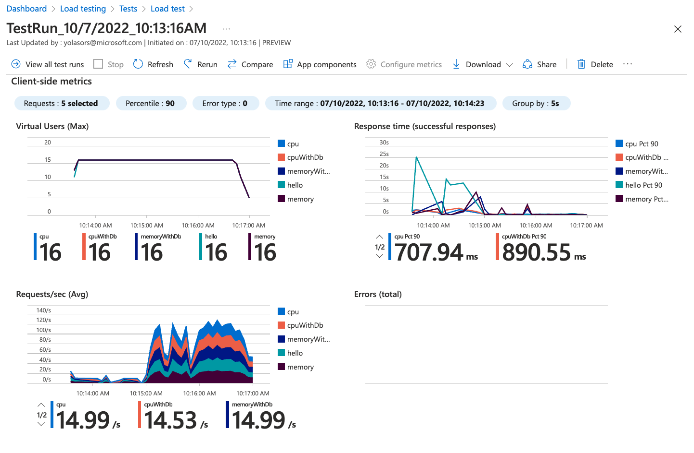
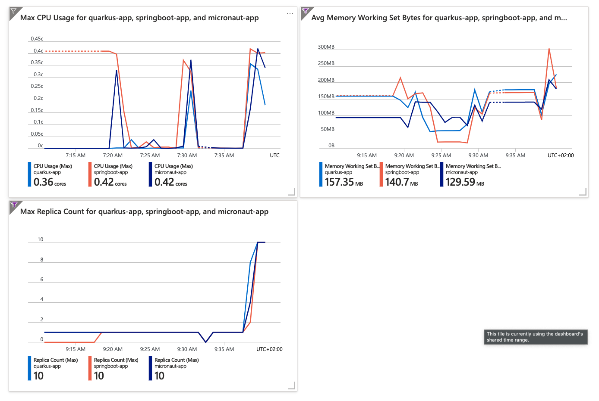

[[scaling]]
= Scaling

'''

Our microservices have several endpoints consuming memory or CPU.
Depending on the number of iterations and bites we pass as parameters to these endpoints, it can take significantly longer to respond.
We are going to explore the problem by looking at CPU and memory metrics.

== CPU

When you know CPU usage you are better prepared to answer the following questions:

* Is the amount of CPU resources maxed out?
* Have I over provisioned the amount of CPU resources?
* What does the baseline of usage looks like?
* Is there room to grow without scaling out or up?
* How much of the available CPU resources is it really using?
* What type of load is it?

== Memory

When you know memory usage you are better prepared to answer the following questions:

* Is the amount of memory used close to the maximum available memory?
* Have I over provisioned the amount of memory resources?
* What does the baseline of usage look like?
* Is there room to grow without scaling out or up?
* How much of the available memory resources is it really using?

[[scaling-listing-rest-resource]]
.REST Resource
[source,indent=0]
----
----

== Monitoring

One of the first thing you usually want to do once your application is deployed is to configure monitoring.
We'll use the https://portal.azure.com[Azure portal] to create a nice dashboard for monitoring our application metrics.

Open the Azure portal and navigate to the resource group `rg-java-runtimes` you created for your application. Select the `quarkus-app` container app, then select *Metrics* from the left menu, under the *Monitoring* group.

image::../images/aca-metrics.png[Screenshot of the Azure portal showing the metrics panel for the container app]

Using the *Metrics* panel, you can select which metrics you want to observe, and the time range for the data. Under the _Standard Metrics_ namespace, you can see the list of available built-in metrics for your application. You can also create https://learn.microsoft.com/azure/azure-monitor/essentials/metrics-custom-overview?[your own custom metrics].

image::../images/standard-metrics.png[Screenshot of the Azure portal showing the list of standard metrics]

Select "_CPU Usage_" from the list of metrics, and select the last 30 minutes hours for the time range. You can see the CPU and memory usage for your application.

=== Creating charts for all services

Now let's add the CPU metrics of the Micronaut and Spring apps to the same chart.
Select *Add metric* and select "_CPU Usage_" again. Then click on the *Scope* setting, unselect `quarkus-app` and pick the `micronaut-app`. Select *Apply*, and repeat the same for the `spring-app`.

Now you should see a nice chart with the CPU usage of all three applications. Let's save this chart on the dashboard!

Select *Save to dashboard* and choose *Pin to dashboard*:

In the _Pin to dashboard_ dialog, select *Create new* and give it a name, for example "Java Runtimes" then click *Create and pin*.

We'll also add charts to monitor the memory usage and number of replicas of our applications.

Select *Add chart* and repeat the same steps as before to create a chart with "_Memory Working Set Bytes_" metrics and another one with the "_Replica Count_" metric. Don't forget to save them to the dashboard we created earlier!

When you're finished, in the Azure portal sidebar select *Dashboards* and choose the "_Java Runtimes_" dashboard we created earlier.

You should now see the 3 charts you just created. You can rearrange the charts by dragging them around, and resize them by dragging the bottom right corner.

== Logs

// Open console/system logs from the CLI for each service
// Laius on Kustus/log queries/log tracing/correlation ID

== Load Testing

Now it's time to add some load to the application. This will allow us to see how the auto-scaling features works in Azure Container Apps.

To add some load to an application, you can do it locally using https://jmeter.apache.org[JMeter], but you can also do it remotely on Azure using https://azure.microsoft.com/services/load-testing[Azure Load Testing] and JMeter.

Azure Load Testing is a fully managed load-testing service built for Azure that makes it easy to generate high-scale load and identify app performance bottlenecks.
It is available on the https://azuremarketplace.microsoft.com[Azure Marketplace].

=== Setting up Azure Load Testing

To use Azure Load Testing, go to the https://portal.azure.com[Azure Portal], select *Create a resource* in the sidebar and search for "_Azure Load Testing_".

image::../images/portal-create-resource-load-testing.png[Screenshot of searching for Azure Load Testing in Azure Portal]

1. Select *Create*:
+
image::../images/load-testing-create.png[Azure Load Testing creation screen]

2. In the **Resource group** field, select the `rg-java-runtimes` that we created previously.

3. Set the name `lt-java-runtimes` for the load testing instance.

4. Set the location to match our previously created resources (East US).

5. Select **Review + Create**, then **Create**.

Creating a load testing resource can take a few moment.
Once created, you should see the Azure Load Testing available in your resource group: 

image::../images/load-testing-group.png[Screenshot of Azure Load Testing in Resource group]

Select `lt-java-runtimes`, and then click on *Tests* and then *Create*.

1. You can either create a quick load test using a wizard, or create a load test using a JMeter script. Choose this second option.

2. Before uploading a JMeter script, create a load test by entering a name (eg. "_Make them fight_"), a description and select **Next**: 
+

3. Now that you are on the "Test plan" tab, you can upload the JMeter file (located under `scripts/jmeter/src/test/jmeter/load.jmx`) as well as the `user.properties` file. 
+
The JMeter file sets up a load campaign targetting the "cpu" endpoint.
+
Before uploading the `user.properties` file, make sure you change the properties so you target the `FightResource` endpoint URL:
+
[source,properties]
----
# Change these numbers depending on the load you want to add to the application
LOOPS=20
THREADS=2
RAMP=1

# Put your quarkus host here
QUARKUS_HOST=quarkus-app.mangodesert-f75fa955.eastus.azurecontainerapps.io
QUARKUS_PROTOCOL=https
QUARKUS_PORT=443

# Put your spring host here
SPRING_HOST=springboot-app.mangodesert-f75fa955.eastus.azurecontainerapps.io
SPRING_PROTOCOL=https
SPRING_PORT=443

# Put your micronaut host here
MICRONAUT_PROTOCOL=https
MICRONAUT_HOST=micronaut-app.mangodesert-f75fa955.eastus.azurecontainerapps.io
MICRONAUT_PORT=443
----

4. Select *Upload*, and choose "_User properties_" in the *File relevance* field of the `user.properties` file.
+
image::../images/load-testing-upload.png[Screenshot of test plan setup]

5. Select *Review + Create*, then *Create*.

=== Running the tests

After the test creation, it will start automatically after a short time.
When the test run finishes, you will get some metrics:

In the Azure portal sidebar, select *Dashboards* and go back to the "_Java Runtimes_" dashboard we created earlier.

If you take a look at the charts, you can see CPU and memory usage increase, and also that the number of replicas has increased from 1 replica to 10.
Azure Container Apps has scaled automatically the application depending on the load.

// TODO: update with 3 services

== Scaling

// Set up CPU/Memory scaling
// Run load tests again with updated parameters
