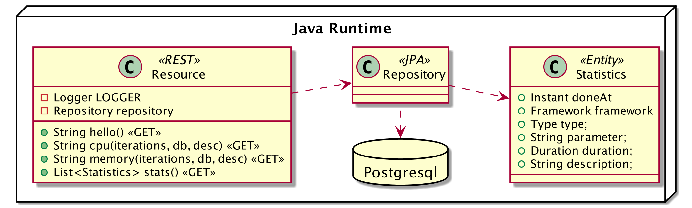
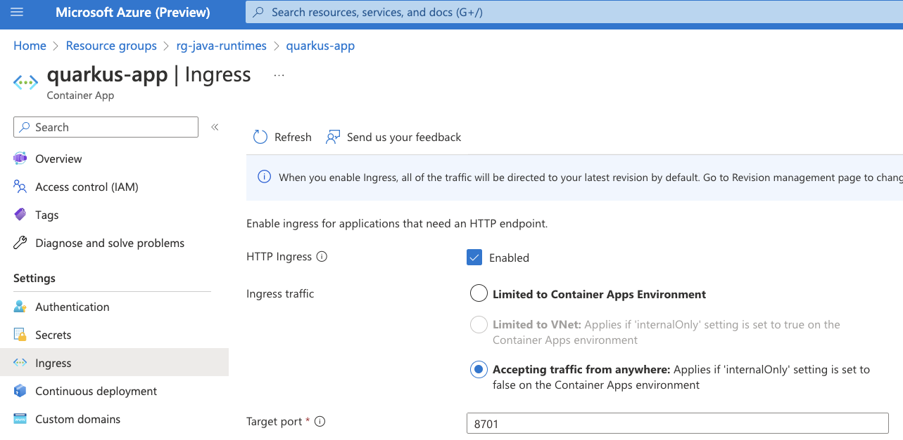
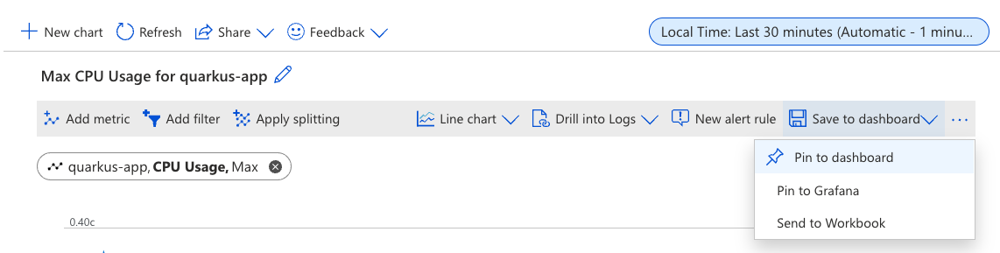
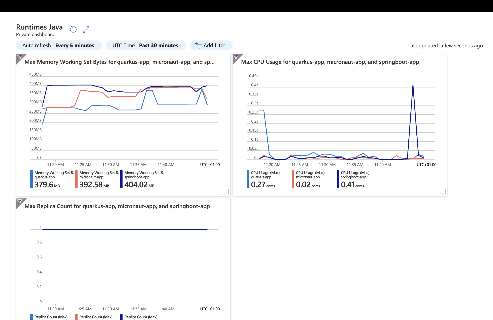
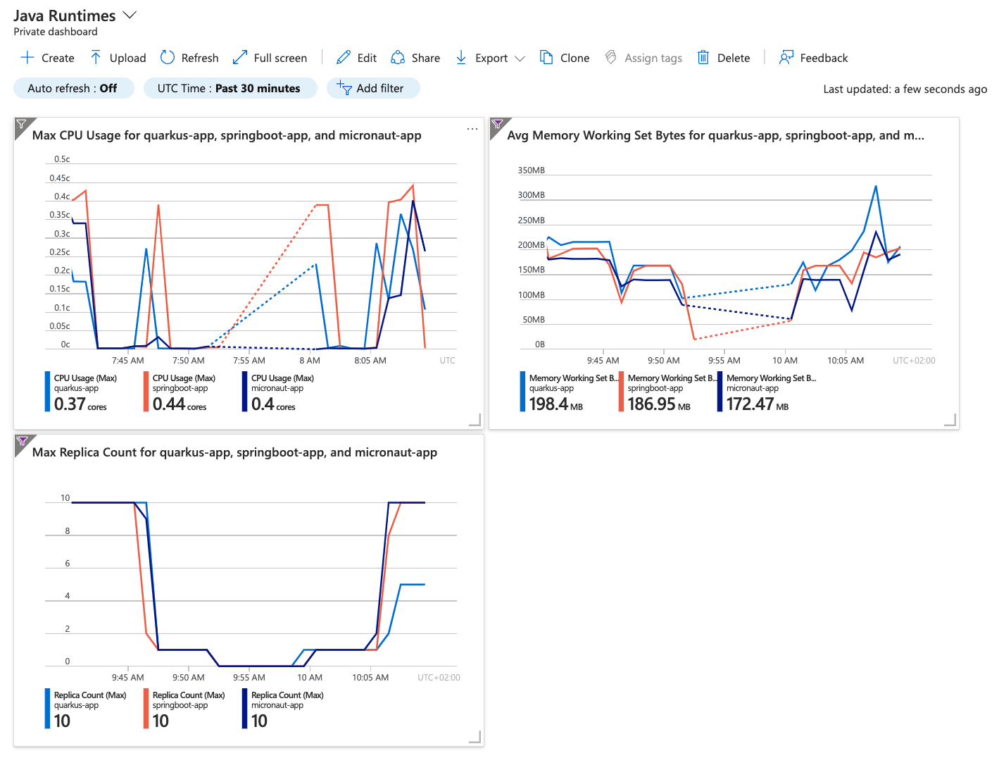

# Java Runtimes and Azure Container Apps Workshop

## Welcome

This workshop offers attendees an intro-level, hands-on session on Cloud performance using different Java runtimes:
From developing microservices written in Quarkus/Spring Boot/Micronaut, to packaging them in Docker containers, deploy them in Azure Container Apps and monitor the performances.
You will analyze CPU load as well as memory usage.
And then you will establish a baseline, so you can see the impact of scaling out or scaling up containers.

This workshop is a BYOL (*Bring Your Own Laptop*) session, so bring your Windows, OSX, or Linux laptop.
You need JDK 17 on your machine, Apache Maven (3.9.x), Docker, Azure CLI and other few tools.
On Mac and Windows, Docker for *x* is recommended instead of the Docker toolbox setup.

What you are going to do:

- Create your own GitHub Repo based on a GitHub Template
- Develop one microservice that consumes CPU and memory with Quarkus, another one with Spring Boot and Micronaut
- Compile, package and containerize these microservices
- Run these microservices locally on your machine
- Create an Azure Container Apps environment
- Deploy your containers to Azure Container Apps
- Execute and monitor the microservices using different performance parameters
- Load test the microservices
- Analyze CPU load and scale containers appropriately
- Analyze memory and scale containers appropriately
- And much more!
Ready? Here we go!
Check the workshop at [https://aka.ms/java-runtimes](https://aka.ms/java-runtimes) of flash the QR Code if you don’t want to type.


### Presenting the Workshop

This workshop is about understanding the performance of Java runtimes in a containerized environment in the cloud.
It is a hands-on workshop, so you will be doing a lot of things in your local machine as well as on [Azure Container Apps](https://learn.microsoft.com/azure/container-apps/overview?WT.mc_id=javascript-0000-yolasors).

Today, most of us containerize our Java applications and then deploy them to the cloud.
But how do we know if our application is performing well?
What do we do if we see a spike in CPU or memory usage?
Do we scale out or scale up?
Do we change the JVM parameters?
Do we change the container size?
And what about having native binaries and compiling our code with GraalVM?

#### What Is This Workshop About?

To understand performance in a containerized environment we need a few simple algorithms that consume CPU and memory.
We will then develop these same algorithms in [Quarkus](https://quarkus.io), [Spring Boot](https://spring.io/projects/spring-boot) and [Micronaut](https://micronaut.io), deploy them to [Azure Container Apps](https://learn.microsoft.com/azure/container-apps/overview?WT.mc_id=javascript-0000-yolasors) and monitor their performance.

The algorithm consuming CPU will be a simple loop.
The higher the iteration, the more CPU it uses:

```java
while (iterations > 0) {
    if (iterations % 20000 == 0) {
        try {
            Thread.sleep(20);
        } catch (InterruptedException ie) {
        }
    }
    iterations--;
}
```
The algorithm consuming memory will be a simple hashmap that we will fill with bites.
The more bits you have, the more memory it uses:

```java
HashMap hunger = new HashMap<>();
for (int i = 0; i < bites * 1024 * 1024; i += 8192) {
    byte[] bytes = new byte[8192];
    hunger.put(i, bytes);
    for (int j = 0; j < 8192; j++) {
        bytes[j] = '0';
    }
}
```
#### What Will You Be Developing?

You will be developing 3 microservices, each doing the exact same thing (consuming CPU and memory), but using a different Java runtime: Quarkus, Spring Boot and Micronaut:

- A REST endpoint (used as an entry point) that will execute our CPU and memory consuming algorithms
- A repository used to store the results of the CPU and memory consuming algorithms
- A statistics entity mapped to the relational database


#### What Will You Be Deploying?

Once developed and tested locally, you will be packaging your microservices in Docker containers and deploy them to Azure Container Apps:

- You will first create an Azure Container Apps environment (a.k.a. *ACA*) in Azure
- You will create a managed PostgreSQL database in Azure (one single database for all 3 microservices but one table per microservice)
- You will create an Azure Registry to manage the Docker images
- You will package each microservice in Docker images and configure them so they can connect to the PostgreSQL database
- You will then push these images to Azure Container Registry
- Then you will deploy the Docker images of your microservices into the ACA environment


#### Structure of the Workshop

You have this material in your hands, and you can now follow it step by step.
The structure of this workshop is as follows:

- *Setting Up the Project*:
In this section, you will install all the tools and code to be able to bundle, package and deploy our application.
- *Developing the Quarkus Application*:
In this section, you will develop a microservice using Quarkus, test it and run it locally.
- *Developing the Micronaut Application*:
In this section, you will develop a microservice using Micronaut.
- *Developing the Spring Boot Application*:
In this section, you will develop a microservice using Spring Boot.
- *Setting Up the Azure Container Apps Environment*:
This section introduces Azure and the Container Apps service to prepare all the needed resources for our application.
You will create an entire infrastructure on Azure (Container Registry, PostgreSQL database, etc.) to make everything ready for deployment.
- *Deploying the Applications*:
In this section, you will set up a CI/CD pipeline using GitHub Actions so that our application builds and deploy automatically on new commits.
You will build Docker images out of our microservices, push them to Azure Registry, all that using Docker and Azure CLI.
- *Load Testing, Scaling and Monitoring the Applications*:
In this section, you will add some load to your microservices, monitor them, scale them, check the logs, etc.
- *Going Native*:
In this section you will compile your microservices with GraalVM, package them, deploy them on ACA, and see how it impacts the performance.

<div class="info" data-title="note">

> This workshop is **modular**, meaning that you can skip some sections if you want.
> For example, if you’re not interested in developing some microservices variants, you can instead use these pre-built Docker images when deploying to Azure Container Apps:
> 
> ```text
> ghcr.io/azure/aca-java-runtimes-workshop/quarkus-app:latest
> ghcr.io/azure/aca-java-runtimes-workshop/micronaut-app:latest
> ghcr.io/azure/aca-java-runtimes-workshop/springboot-app:latest
> ghcr.io/azure/aca-java-runtimes-workshop/quarkus-app-native:latest
> ghcr.io/azure/aca-java-runtimes-workshop/micronaut-app-native:latest
> ghcr.io/azure/aca-java-runtimes-workshop/springboot-app-native:latest
> ```

</div>

#### What Do You Have to Do?

This workshop should be as self-explanatory as possible.
So your job is to follow the instructions by yourself, do what you are supposed to do, and do not hesitate to ask for any clarification or assistance; that’s why the team is here.

Oh, and be ready to have some fun!

### Presenting Azure and Cloud Services

Azure is Microsoft’s cloud platform.
It provides a wide range of services, from compute to storage, from databases to AI, from IoT to containers, from networking to security, and much more.

For this workshop, we’ll use in particular the following services:

- Azure Container Apps: a managed container service to run our microservices.
- Azure Container Registry: a private container registry to store our Docker images.
- Azure Database for PostgreSQL: a managed PostgreSQL database.
#### What’s Azure Container Apps?

[Azure Container Apps](https://azure.microsoft.com/products/container-apps/?WT.mc_id=javascript-0000-yolasors) is a fully managed serverless container service on Azure.
It allows you to run containerized applications without worrying about orchestration or managing complex infrastructure such as Kubernetes.
You write code using your preferred programming language or framework (in this workshop it’s Java and Quarkus, but it can be anything), and build microservices with full support for Distributed Application Runtime ([Dapr](https://dapr.io/)).
Then, your containers will scale dynamically based on HTTP traffic or events powered by Kubernetes Event-Driven Autoscaling ([KEDA](https://keda.sh)).

There are already a few compute resources on Azure: from IaaS  to FaaS .
Azure Container Apps sits between PaaS  and FaaS .
On one hand, it feels more PaaS, because you are not forced into a specific programming model and you can control the rules on which to scale out / scale in.
On the other hand, it has quite some serverless characteristics like scaling to zero, event-driven scaling, per second pricing and the ability to leverage Dapr’s event-based bindings.


Container Apps is built on top of Azure Kubernetes Service, including a deep integration with KEDA (event-driven auto scaling for Kubernetes), Dapr (distributed application runtime) and Envoy (a service proxy designed for cloud-native applications).
The underlying complexity is completely abstracted for the end-user.
So no need to configure your K8S service, deployment, ingress, volume manifests… You get a very simple API and user interface to configure the desired configuration for your containerized application.
This simplification means also less control, hence the difference with AKS.


Azure Container Apps has the following features:

- *Revisions*: automatic versioning that helps to manage the application lifecycle of your container apps
- *Traffic control*: split incoming HTTP traffic across multiple revisions for Blue/Green deployments and A/B testing
- *Ingress*: simple HTTPS ingress configuration, without the need to worry about DNS and certificates
- *Autoscaling*: leverage all KEDA-supported scale triggers to scale your app based on external metrics
- *Secrets*: deploy secrets that are securely shared between containers, scale rules and Dapr sidecars
- *Monitoring*: the standard output and error streams are automatically written to Log Analytics
- *Dapr*: through a simple flag, you can enable native Dapr integration for your Container Apps
Azure Container Apps introduces the following concepts:

- *Environment*: this is a secure boundary around a group of Container Apps.
They are deployed in the same virtual network, these apps can easily intercommunicate easily with each other and they write logs to the same Log Analytics workspace.
An environment can be compared with a Kubernetes namespace.
- *Container App*: this is a group of containers (pod) that is deployed and scale together.
They share the same disk space and network.
- *Revision*: this is an immutable snapshot of a Container App.
New revisions are automatically created and are valuable for HTTP traffic redirection strategies, such as A/B testing.


---

## Setting Up the Project

Before starting the development, you need to set up the project.
This includes:

- Creating a new project on GitHub based on an existing GitHub template
- Setting up your development environment, either by installing all the needed tools manually, or installing a few tools and relying on VSCode and Dev Containers (easier as everything is set up for you).
### Using the GitHub Template

Open [this GitHub repository](https://github.com/Azure/aca-java-runtimes-workshop-template) and click on `Use this template`.


You will be redirected to the repository creation page.
Select the owner of the repository, enter a name for your new repository (eg.
`aca-java-runtimes-workshop`), set the repo visibility to `public` and click on `Create repository from template`.

Once the repository is created, you have 3 options to work on the project:

- You can work locally using your preferred IDE, but you will need to install all the tools manually.
- You can work directly in [GitHub Codespaces](https://github.com/features/codespaces), without having to install anything on your machine.
- You can work locally using VSCode, Docker and [Dev Containers](https://code.visualstudio.com/docs/remote/containers?WT.mc_id=javascript-0000-yolasors), so you have a pre-configured development environment.
All these options are described in the following sections, pick the one that suits you best.

If you want to work locally, first you need to clone the project on your machine using git (you can skip these steps if you choose to use GitHub Codespaces).

1.
Select the ***Code*** button, then copy your repository url.


2.
Open a terminal and run:

```shell
git clone <your_repo_url>
```
### Setting Up Your Development Environment Manually

If you decide to setup your environment yourself, you will need to install the following tools:

|  |  |
| :-- | :-- |
| Java 17 | [Get OpenJDK](https://learn.microsoft.com/java/openjdk/download?WT.mc_id=javascript-0000-yolasors) |
| Maven 3.9.x | [Get Maven](https://maven.apache.org/download.cgi) |
| Docker 20.x | [Get Docker](https://docs.docker.com/get-docker) |
| Azure CLI | [Get Azure CLI](https://learn.microsoft.com/cli/azure/install-azure-cli?WT.mc_id=javascript-0000-yolasors#install) |
| Git | [https://git-scm.com](https://git-scm.com) |
| GitHub account | [https://github.com/join](https://github.com/join) |
| Azure account | [Get a free Azure account](https://azure.microsoft.com/free?WT.mc_id=javascript-0000-yolasors) |
| A code editor, such as VS Code, Eclipse, or IntelliJ | [Get VS Code](https://code.visualstudio.com/Download?WT.mc_id=javascript-0000-yolasors) |
| cURL (or any other HTTP client) | [Get cURL](https://curl.se/download.html) |
| GraalVM (optional) | [Get GraalVM](https://www.graalvm.org/downloads) |
| jq (optional) | [Get jq](https://stedolan.github.io/jq/download) |

You can test your installation by running the following commands:

```shell
java -version
mvn --version
docker --version
az --version
git --version
curl --version
jq --version
```
If everything is installed correctly, you should see the version of each tool.


<div class="important" data-title="warning">

> If you are on Windows, you will need to run **bash** commands.
> You have multiples way to do that:
> 
> - Use the **Git Bash** command line that comes with Git. Open the start menu, and search for "Git Bash".
> - Install the **Windows Subsystem for Linux** (WSL) with a Linux distribution (eg. Ubuntu).
> You can follow the instructions [here](https://learn.microsoft.com/windows/wsl/install?WT.mc_id=javascript-0000-yolasors).
> - Use **Visual Studio Code** with the Dev Containers setup (see below).

</div>

### Setting Up Your Environment in GitHub Codespaces

[GitHub Codespaces](https://github.com/features/codespaces) allows you to have an instant dev environment already prepared for this workshop.


<div class="info" data-title="note">

> Codespaces includes up to 60 hours of free usage per month for all GitHub users, see [the pricing details here]([https://github.com/features/codespaces](https://github.com/features/codespaces)).
> 

</div>

After your project created on GitHub, select the ***Code*** button, then the ***Codespaces*** tab and click on ***Create Codespaces on main***.


This will start the creation of a dev container environment, which is a pre-configured container with all the needed tools installed. Once it’s ready, you have everything you need to start coding for this workshop.

### Setting Up Your Environment with VSCode and Dev Containers

If you have VS Code and Docker installed on your machine, a quick way to set up your environment is to use the pre-configured [Dev Containers](https://code.visualstudio.com/docs/remote/containers?WT.mc_id=javascript-0000-yolasors) of the template project.
Install the [Remote Development extension](https://marketplace.visualstudio.com/items?itemName=ms-vscode-remote.vscode-remote-extensionpack&WT.mc_id=javascript-0000-yolasors) in VS Code.


<div class="tip" data-title="tip">

> You can learn more about Dev Containers in [this video series](https://learn.microsoft.com/shows/beginners-series-to-dev-containers/?WT.mc_id=javascript-0000-yolasors).
> [Check the website](https://containers.dev) and [the specification](https://github.com/devcontainers/spec) if you want to know all the details of Dev Containers.
> 

</div>


Click on the green **Install** button.
This opens VSCode on the plugin page, ready to install the Remote Development extension.
Click on **Install**
Then, open your project in VSCode.
Open the **Command Palette** (View → Command Palette) and enter "Rebuild and Reopen in Container".


The first time it will take some time to download and setup the container image, meanwhile you can go ahead and read the next sections.


Once the container is ready, you will see the following message in the bottom right corner of VSCode:


### Building the Initial Project

No matter if you have installed the tools manually or used the Dev Containers, you can now build the initial project.
Go to the directory where you cloned the repository and build the code with the following Maven command (careful, the first invocation of `mvn install` can take a while):

```shell
cd <your_repo_url>
mvn install
```
You should see the following output:

```shell
[INFO] ------------------------------------------------------------------------
[INFO] Reactor Summary:
[INFO]
[INFO] Azure Container Apps and Java Runtimes Workshop 1.0.0-SNAPSHOT SUCCESS
[INFO] Azure Container Apps and Java Runtimes Workshop :: Micronaut 1.0.0-SNAPSHOT SUCCESS
[INFO] Azure Container Apps and Java Runtimes Workshop :: Springboot 1.0.0-SNAPSHOT  SUCCESS
[INFO] Azure Container Apps and Java Runtimes Workshop :: Quarkus 1.0.0-SNAPSHOT SUCCESS
[INFO] ------------------------------------------------------------------------
[INFO] BUILD SUCCESS
[INFO] ------------------------------------------------------------------------
[INFO] Total time:  16.097 s
[INFO] Finished at: 2022-10-07T09:46:16+02:00
[INFO] ------------------------------------------------------------------------
```

<div class="important" data-title="warning">

> If `mvn install` doesn’t manage to download the dependencies, you might need to configure your proxy settings, or you might have a different `settings.xml`.
> Check if you have a file called `settings.xml` in your `~/.m2` directory.
> If you do, check if it contains a `<proxies>` section and if it’s the right one.
> If you are not sure, try removing (or renaming) the `settings.xml` file and try again doing a `mvn install`.
> 

</div>

Now that you have your development environment setup and that you can build the initial code, let’s develop our three microservices.


---

## Developing the Quarkus Application

In this section you will:

- Develop a REST API with Quarkus that consumes memory and CPU
- Add a Statistics persistent entity to store metrics in a PostgreSQL database
- Configure the application
- Develop some tests to validate the behavior of the application
- Test the application locally
- Run the application locally
- Check a few metrics locally
When you created your repository from the GitHub template, you should have a directory called `quarkus-app` in your current directory.
This is the root of the Quarkus microservice source code that we will be using in this section.

### The Quarkus REST Resource

The Quarkus application is made of a simple REST resource that consumes memory and CPU.
The resource is defined in the `QuarkusResource` class.
Create a new file called `QuarkusResource.java` under the `src/main/java/io/containerapps/javaruntime/workshop/quarkus` folder.
Then, add the following to the header of the class.
As you can see, it is a JAX-RS resource that is exposed on the `/quarkus` path.

```java
package io.containerapps.javaruntime.workshop.quarkus;

import jakarta.ws.rs.DefaultValue;
import jakarta.ws.rs.GET;
import jakarta.ws.rs.Path;
import jakarta.ws.rs.Produces;
import jakarta.ws.rs.QueryParam;
import jakarta.ws.rs.core.MediaType;
import java.lang.System.Logger;
import java.time.Duration;
import java.time.Instant;
import java.util.HashMap;
import java.util.List;

import static java.lang.System.Logger.Level.INFO;
import static java.lang.invoke.MethodHandles.lookup;

@Path("/quarkus")
@Produces(MediaType.TEXT_PLAIN)
public class QuarkusResource {

    private static final Logger LOGGER = System.getLogger(lookup().lookupClass().getName());

    private final StatisticsRepository repository;

    public QuarkusResource(StatisticsRepository statisticsRepository) {
        this.repository = statisticsRepository;
    }
}
```
Let’s add a `hello` method returning *Hello World* so we can quickly check if our endpoint responds or not.

```java
@GET
public String hello() {
    LOGGER.log(INFO, "Quarkus: hello");
    return "Quarkus: hello";
}
```
Let’s now add a `cpu` method that consumes CPU depending on a few optional parameters.

- `iterations` the more iterations you have, the more CPU it consumes.
- `db` if this parameter is set to true, the statistics are stored in the database.
That allows us to check the impact of the database on the CPU consumption.
- `desc` any optional description you want to persist in the database
```java
@GET
@Path("/cpu")
public String cpu(@QueryParam("iterations") @DefaultValue("10") Long iterations,
                  @QueryParam("db") @DefaultValue("false") Boolean db,
                  @QueryParam("desc") String desc) {
    LOGGER.log(INFO, "Quarkus: cpu: {0} {1} with desc {2}", iterations, db, desc);
    Long iterationsDone = iterations;

    Instant start = Instant.now();
    if (iterations == null) {
        iterations = 20000L;
    } else {
        iterations *= 20000;
    }
    while (iterations > 0) {
        if (iterations % 20000 == 0) {
            try {
                Thread.sleep(20);
            } catch (InterruptedException ie) {
            }
        }
        iterations--;
    }

    if (db) {
        Statistics statistics = new Statistics();
        statistics.type = Type.CPU;
        statistics.parameter = iterations.toString();
        statistics.duration = Duration.between(start, Instant.now());
        statistics.description = desc;
        repository.persist(statistics);
    }

    String msg = "Quarkus: CPU consumption is done with " + iterationsDone + " iterations in " + Duration.between(start, Instant.now()).getNano() + " nano-seconds.";
    if (db) {
        msg += " The result is persisted in the database.";
    }
    return msg;
}
```
Now, add a `memory` method that consumes memory depending on a few optional parameters.

- `bites` the more bits you have, the more memory it consumes.
- `db` if this parameter is set to true, the statistics are stored in the database.
- `desc` any optional description you want to persist in the database
```java
@GET
@Path("/memory")
public String memory(@QueryParam("bites") @DefaultValue("10") Integer bites,
                     @QueryParam("db") @DefaultValue("false") Boolean db,
                     @QueryParam("desc") String desc) {
    LOGGER.log(INFO, "Quarkus: memory: {0} {1} with desc {2}", bites, db, desc);

    Instant start = Instant.now();
    if (bites == null) {
        bites = 1;
    }
    HashMap hunger = new HashMap<>();
    for (int i = 0; i < bites * 1024 * 1024; i += 8192) {
        byte[] bytes = new byte[8192];
        hunger.put(i, bytes);
        for (int j = 0; j < 8192; j++) {
            bytes[j] = '0';
        }
    }

    if (db) {
        Statistics statistics = new Statistics();
        statistics.type = Type.MEMORY;
        statistics.parameter = bites.toString();
        statistics.duration = Duration.between(start, Instant.now());
        statistics.description = desc;
        repository.persist(statistics);
    }

    String msg = "Quarkus: Memory consumption is done with " + bites + " bites in " + Duration.between(start, Instant.now()).getNano() + " nano-seconds.";
    if (db) {
        msg += " The result is persisted in the database.";
    }
    return msg;
}
```
Let’s also create a method to retrieve the statistics from the database.
This is very easy to do with [Panache](https://quarkus.io/guides/hibernate-orm-panache).

```java
@GET
@Path("/stats")
@Produces(MediaType.APPLICATION_JSON)
public List<Statistics> stats() {
    LOGGER.log(INFO, "Quarkus: retrieving statistics");
    return Statistics.findAll().list();
}
```
At this stage, the code does not compile yet, because there are a few missing classes.
Let’s create them now.

### Transactions and ORM

When the database is enabled, the statistics are stored in the database.
For that we need a `Statistics` entity with a few enumerations that will be mapped to the PostgreSQL database.
Create the `Statistics` entity in the `src/main/java/io/containerapps/javaruntime/workshop/quarkus` folder.

```java
package io.containerapps.javaruntime.workshop.quarkus;

import io.quarkus.hibernate.orm.panache.PanacheEntity;

import jakarta.persistence.Column;
import jakarta.persistence.Entity;
import jakarta.persistence.Table;
import java.time.Duration;
import java.time.Instant;

@Entity
@Table(name = "Statistics_Quarkus")
public class Statistics extends PanacheEntity {

    @Column(name = "done_at")
    public Instant doneAt = Instant.now();
    public Framework framework = Framework.QUARKUS;
    public Type type;
    public String parameter;
    public Duration duration;
    public String description;
}

enum Type {
    CPU, MEMORY
}

enum Framework {
    QUARKUS, MICRONAUT, SPRINGBOOT
}
```
For manipulating the entity, we need a repository.
Create the `StatisticsRepository` class under the same package.
Notice that `StatisticsRepository` is a [Panache Repository](https://quarkus.io/guides/hibernate-orm-panache) that extends the `PanacheRepository` class.

```java
package io.containerapps.javaruntime.workshop.quarkus;

import io.quarkus.hibernate.orm.panache.PanacheRepository;

import jakarta.enterprise.context.ApplicationScoped;
import jakarta.transaction.Transactional;

@ApplicationScoped
@Transactional
public class StatisticsRepository implements PanacheRepository<Statistics> {
}
```
### Compiling the Quarkus Application

You should have all the code to compile the application.
To make sure you have all the code and dependencies, run the following command:

```shell
mvn compile
```
### Configuring the Quarkus Application

There is not much to configure as Quarkus is configured by default to use the PostgreSQL database (thanks to [DevService](https://quarkus.io/guides/dev-services)).
To make sure our 3 microservices can run side by side, we need to configure the listening port of the Quarkus application.
To have this service exposed on the port 8701, add the following configuration in the `src/main/resources/application.properties` file.

```java
quarkus.http.port=8701
```
### Testing the Quarkus Application Locally

Now, to make sure that the application works as expected, we need to write some tests.
For that, we will use [Quarkus Test Framework](https://quarkus.io/guides/getting-started-testing) that is based on [JUnit 5](https://junit.org/junit5/) and use [RESTAssured](https://github.com/rest-assured/rest-assured).
Behind the scene, Quarkus uses [Testcontainers](https://www.testcontainers.org) with its [DevServices](https://quarkus.io/guides/dev-services) feature.
That’s why we need Docker to run the tests and run the application.

Create the `QuarkusResourceTest` class under the `src/test/java/io/containerapps/javaruntime/workshop/quarkus` folder.
Then, add the following to the header of the class.

```java
package io.containerapps.javaruntime.workshop.quarkus;

import io.quarkus.test.junit.QuarkusTest;
import org.junit.jupiter.api.Test;

import static io.restassured.RestAssured.given;
import static org.hamcrest.CoreMatchers.*;

@QuarkusTest
public class QuarkusResourceTest {
}
```
First, let’s write a test to check that the `hello` method returns the right *Hello World* string.

```java
@Test
public void testHelloEndpoint() {
    given()
      .when().get("/quarkus")
      .then()
        .statusCode(200)
        .body(is("Quarkus: hello"));
}
```
Then, we write another test to check that the `cpu` method consumes CPU and takes the right parameters.

```java
@Test
public void testCpuWithDBAndDescEndpoint() {
    given().param("iterations", 1).param("db", true).param("desc", "Java17")
      .when().get("/quarkus/cpu")
      .then()
        .statusCode(200)
        .body(startsWith("Quarkus: CPU consumption is done with"))
        .body(not(containsString("Java17")))
        .body(endsWith("The result is persisted in the database."));
}
```
And we do the same for the `memory` method.

```java
@Test
public void testMemoryWithDBAndDescEndpoint() {
    given().param("bites", 1).param("db", true).param("desc", "Java17")
      .when().get("/quarkus/memory")
      .then()
        .statusCode(200)
        .body(startsWith("Quarkus: Memory consumption is done with"))
        .body(not(containsString("Java17")))
        .body(endsWith("The result is persisted in the database."));
}
```
Let’s also create a simple test to make sure the statistics are stored in the database.

```java
@Test
public void testStats() {
    given()
      .when().get("/quarkus/stats")
      .then()
        .statusCode(200);
}
```
Now that you have your tests methods, make sure you have **Docker Desktop up and running** (as it needs to start a PostgreSQL database) and run them with the following command (the first Quarkus test can take a while as Testcontainers needs to download the PostgreSQL image):

```shell
mvn test
```
All the tests should pass and you should see the following output:

```shell
[INFO] Tests run: 4, Failures: 0, Errors: 0, Skipped: 0
[INFO]
[INFO] ------------------------------------------------------------------------
[INFO] BUILD SUCCESS
[INFO] ------------------------------------------------------------------------
```

<div class="important" data-title="warning">

> If your test fail with the following error, it means that Docker Desktop is not running or that the `docker.sock` file is not available:
> 
> ```shell
> Previous attempts to find a Docker environment failed. Will not retry
> ```
> To fix this, you need to create a symbolic link to the `docker.sock` file:
> 
> ```shell
> sudo ln -s $HOME/.docker/run/docker.sock /var/run/docker.sock
> ```

</div>

### Running the Quarkus Application Locally

Now that the tests are all green, let’s execute the application locally and execute a few `curl` commands.
Make sure you still have Docker up and running and execute the following command under the `quarkus-app` directory:

```shell
mvn quarkus:dev
```
In another terminal you can execute the following `curl` commands to invoke the endpoint:

```shell
curl 'localhost:8701/quarkus'

curl 'localhost:8701/quarkus/cpu?iterations=10&db=true&desc=java17'

curl 'localhost:8701/quarkus/memory?bites=10&db=true&desc=java17'
```
You can change the parameters to see how the application behaves.
Change the number of iterations and the number of bites to see how the performance is impacted (with and without database).

```shell
curl 'localhost:8701/quarkus/cpu?iterations=50'
curl 'localhost:8701/quarkus/cpu?iterations=100'
curl 'localhost:8701/quarkus/cpu?iterations=100&db=true'

curl 'localhost:8701/quarkus/memory?bites=50'
curl 'localhost:8701/quarkus/memory?bites=100'
curl 'localhost:8701/quarkus/memory?bites=100&db=true'
```
You can check the content of the database with:

```shell
curl 'localhost:8701/quarkus/stats'

# or if you have "jq" installed you can make it prettier with
# curl 'localhost:8701/quarkus/stats' | jq
```
That’s it for the Quarkus application.
Now, let’s move to the Micronaut application.


---

## Developing the Micronaut Application

In this section you will:

- Develop a REST API with Micronaut that consumes memory and CPU (the exact same algorithm than before)
- Add a Statistics persistent entity to store metrics in a PostgreSQL database
- Configure the application
- Develop some tests to validate the behavior of the application
- Test the application locally
- Run the application locally
- Check a few metrics locally
In your repository you should have another directory called `micronaut-app` .
This is the root of the Micronaut microservice source code that we will be using in this section.

### The Micronaut REST Resource

The Micronaut application is also made of a simple REST resource that exposes the endpoints that consume memory and CPU.
Before creating the REST resource, we need to create a main Micronaut class that will bootstrap the application.
Open the `Application` class under the `io/containerapps/javaruntime/workshop/micronaut` package.

```java
package io.containerapps.javaruntime.workshop.micronaut;

import io.micronaut.runtime.Micronaut;

public class Application {

    public static void main(String[] args) {
        Micronaut.run(Application.class, args);
    }
}
```
The REST resource is defined in the `MicronautResource` class.
Create a new file called `MicronautResource.java` under the `src/main/java/io/containerapps/javaruntime/workshop/micronaut` directory.
As you can see in the header of the class, the resource is exposed on the `/micronaut` path.

```java
package io.containerapps.javaruntime.workshop.micronaut;

import io.micronaut.http.MediaType;
import io.micronaut.http.annotation.Controller;
import io.micronaut.http.annotation.Get;
import io.micronaut.http.annotation.QueryValue;

import java.lang.System.Logger;
import java.time.Duration;
import java.time.Instant;
import java.util.ArrayList;
import java.util.HashMap;
import java.util.List;

import static java.lang.System.Logger.Level.INFO;
import static java.lang.invoke.MethodHandles.lookup;

@Controller("/micronaut")
public class MicronautResource {

    private static final Logger LOGGER = System.getLogger(lookup().lookupClass().getName());

    private final StatisticsRepository repository;

    public MicronautResource(StatisticsRepository statisticsRepository) {
        this.repository = statisticsRepository;
    }
}
```
Let’s add a `hello` method returning *Hello World* so we can quickly check if our endpoint responds or not.

```java
@Get(produces = MediaType.TEXT_PLAIN)
public String hello() {
    LOGGER.log(INFO, "Micronaut: hello");
    return "Micronaut: hello";
}
```
Let’s now add a `cpu` method that consumes CPU depending on a few optional parameters.

- `iterations` the more iterations you have, the more CPU it consumes.
- `db` if this parameter is set to true, the statistics are stored in the database.
That allows us to check the impact of the database on the CPU consumption.
- `desc` any optional description you want to persist in the database
```java
@Get(uri = "/cpu", produces = MediaType.TEXT_PLAIN)
public String cpu(@QueryValue(value = "iterations", defaultValue = "10") Long iterations,
                  @QueryValue(value = "db", defaultValue = "false") Boolean db,
                  @QueryValue(value = "desc", defaultValue = "") String desc) {
    LOGGER.log(INFO, "Micronaut: cpu: {0} {1} with desc {2}", iterations, db, desc);
    Long iterationsDone = iterations;

    Instant start = Instant.now();
    if (iterations == null) {
        iterations = 20000L;
    } else {
        iterations *= 20000;
    }
    while (iterations > 0) {
        if (iterations % 20000 == 0) {
            try {
                Thread.sleep(20);
            } catch (InterruptedException ie) {
            }
        }
        iterations--;
    }

    if (db) {
        Statistics statistics = new Statistics();
        statistics.type = Type.CPU;
        statistics.parameter = iterations.toString();
        statistics.duration = Duration.between(start, Instant.now());
        statistics.description = desc;
        repository.save(statistics);
    }

    String msg = "Micronaut: CPU consumption is done with " + iterationsDone + " iterations in " + Duration.between(start, Instant.now()).getNano() + " nano-seconds.";
    if (db) {
        msg += " The result is persisted in the database.";
    }
    return msg;
}
```
Now, add a `memory` method that consumes memory depending on a few optional parameters.

- `bites` the more bits you have, the more memory it consumes.
- `db` if this parameter is set to true, the statistics are stored in the database.
- `desc` any optional description you want to persist in the database
```java
@Get(uri = "/memory", produces = MediaType.TEXT_PLAIN)
public String memory(@QueryValue(value = "bites", defaultValue = "10") Integer bites,
                     @QueryValue(value = "db", defaultValue = "false") Boolean db,
                     @QueryValue(value = "desc", defaultValue = "") String desc) {
    LOGGER.log(INFO, "Micronaut: memory: {0} {1} with desc {2}", bites, db, desc);

    Instant start = Instant.now();
    if (bites == null) {
        bites = 1;
    }
    HashMap hunger = new HashMap<>();
    for (int i = 0; i < bites * 1024 * 1024; i += 8192) {
        byte[] bytes = new byte[8192];
        hunger.put(i, bytes);
        for (int j = 0; j < 8192; j++) {
            bytes[j] = '0';
        }
    }

    if (db) {
        Statistics statistics = new Statistics();
        statistics.type = Type.MEMORY;
        statistics.parameter = bites.toString();
        statistics.duration = Duration.between(start, Instant.now());
        statistics.description = desc;
        repository.save(statistics);
    }

    String msg = "Micronaut: Memory consumption is done with " + bites + " bites in " + Duration.between(start, Instant.now()).getNano() + " nano-seconds.";
    if (db) {
        msg += " The result is persisted in the database.";
    }
    return msg;
}
```
Let’s also create a method to retrieve the statistics from the database.

```java
@Get(uri = "/stats", produces = MediaType.APPLICATION_JSON)
public List<Statistics> stats() {
    LOGGER.log(INFO, "Micronaut: retrieving statistics");
    List<Statistics> result = new ArrayList<Statistics>();
    for (Statistics stats : repository.findAll()) {
        result.add(stats);
    }
    return result;
}
```
At this stage, the code does not compile yet, because there are a few missing classes.
Let’s create them now.

### Transactions and ORM

When the database is enabled, the statistics are stored in the database.
For that we need a `Statistics` entity with a few enumerations that will be mapped to the PostgreSQL database.
Create the `Statistics` entity in the `src/main/java/io/containerapps/javaruntime/workshop/micronaut` directory.

```java
package io.containerapps.javaruntime.workshop.micronaut;

import javax.persistence.Column;
import javax.persistence.Entity;
import javax.persistence.GeneratedValue;
import javax.persistence.Id;
import javax.persistence.Table;
import java.time.Duration;
import java.time.Instant;

@Entity
@Table(name = "Statistics_Micronaut")
public class Statistics {

    @GeneratedValue
    @Id
    private Long id;
    @Column(name = "done_at")
    public Instant doneAt = Instant.now();
    public Framework framework = Framework.MICRONAUT;
    public Type type;
    public String parameter;
    public Duration duration;
    public String description;

    public Long getId() {
        return id;
    }

    public void setId(Long id) {
        this.id = id;
    }
}

enum Type {
    CPU, MEMORY
}

enum Framework {
    QUARKUS, MICRONAUT, SPRINGBOOT
}
```
For manipulating the entity, we need a repository.
Create the `StatisticsRepository` class under the same package.

```java
package io.containerapps.javaruntime.workshop.micronaut;

import io.micronaut.data.annotation.Repository;
import io.micronaut.data.repository.CrudRepository;

@Repository
interface StatisticsRepository extends CrudRepository<Statistics, Long> {
}
```
### Compiling the Micronaut Application

You should have all the code to compile the application.
To make sure you have all the code and dependencies, run the following command:

```shell
mvn compile
```
### Configuring the Micronaut Application

We need to configure the default PostgreSQL database and Hibernate ORM.
We also need this service to be exposed on the port 8702 (different port from the Quarkus application).
Notice that we use non-blocking threads (`thread-selection: IO`).
Add the following to the `src/main/resources/application.yml` file.

```yaml
micronaut:
  application:
    name: MicronautApp
  server:
    port: 8702
    thread-selection: IO
netty:
  default:
    allocator:
      max-order: 3
datasources:
  default:
    dialect: POSTGRES
    url: jdbc:postgresql://localhost:5432/postgres
    username: postgres
    password: password
    driverClassName: org.postgresql.Driver
jpa:
  default:
    entity-scan:
      packages: 'io.containerapps.javaruntime.workshop.micronaut'
    properties:
      hibernate:
        bytecode:
          provider: none
        hbm2ddl:
          auto: none
```
### Testing the Micronaut Application Locally

Now, to make sure that the application works as expected, we need to write some tests.
Remember that the tests need a PostgreSQL database to run.
For that, we need to configure Testcontainers in a separate class (`MicronautAppTest`)
Open the `MicronautAppTest` class under the `src/test/java/io/containerapps/javaruntime/workshop/micronaut` folder.

```java
package io.containerapps.javaruntime.workshop.micronaut;

import io.micronaut.runtime.EmbeddedApplication;
import io.micronaut.test.extensions.junit5.annotation.MicronautTest;
import org.junit.jupiter.api.BeforeEach;
import org.junit.jupiter.api.Test;
import org.junit.jupiter.api.Assertions;

import jakarta.inject.Inject;
import org.testcontainers.containers.PostgreSQLContainer;
import org.testcontainers.junit.jupiter.Testcontainers;

@Testcontainers
@MicronautTest
class MicronautAppTest {

    private PostgreSQLContainer postgreSQLContainer;

    @Inject
    EmbeddedApplication<?> application;

    @BeforeEach
    public void setUp() {
        postgreSQLContainer = new PostgreSQLContainer("postgres:14")
            .withDatabaseName("postgres")
            .withUsername("postgres")
            .withPassword("password");
    }

    @Test
    void testItWorks() {
        Assertions.assertTrue(application.isRunning());
    }

}
```
Then, all our tests go into the `MicronautResourceTest` class.
Create the `MicronautResourceTest` class under the same package that `MicronautAppTest`.

```java
package io.containerapps.javaruntime.workshop.micronaut;

import io.micronaut.test.extensions.junit5.annotation.MicronautTest;
import io.restassured.specification.RequestSpecification;
import org.junit.jupiter.api.BeforeEach;
import org.junit.jupiter.api.Test;
import org.testcontainers.containers.PostgreSQLContainer;
import org.testcontainers.junit.jupiter.Testcontainers;

import static io.restassured.RestAssured.given;
import static org.hamcrest.CoreMatchers.*;

@Testcontainers
@MicronautTest
class MicronautResourceTest {

    private static String basePath = "http://localhost:8802/micronaut";

    private PostgreSQLContainer postgreSQLContainer;

    @BeforeEach
    public void setUp() {
        postgreSQLContainer = new PostgreSQLContainer("postgres:14")
            .withDatabaseName("postgres")
            .withUsername("postgres")
            .withPassword("password");
    }
}
```
First, let’s write a test to check that the `hello` method returns the right *Hello World* string.

```java
@Test
public void testHelloEndpoint(RequestSpecification spec) {
    spec
      .when().get(basePath)
      .then()
        .statusCode(200)
        .body(is("Micronaut: hello"));
}
```
Then, we write another test to check that the `cpu` method consumes CPU and takes the right parameters.

```java
@Test
public void testCpuWithDBAndDescEndpoint() {
    given().param("iterations", 1).param("db", true).param("desc", "Java17")
      .when().get(basePath + "/cpu")
      .then()
        .statusCode(200)
        .body(startsWith("Micronaut: CPU consumption is done with"))
        .body(not(containsString("Java17")))
        .body(endsWith("The result is persisted in the database."));
}
```
And we do the same for the `memory` method.

```java
@Test
public void testMemoryWithDBAndDescEndpoint() {
    given().param("bites", 1).param("db", true).param("desc", "Java17")
      .when().get(basePath + "/memory")
      .then()
        .statusCode(200)
        .body(startsWith("Micronaut: Memory consumption is done with"))
        .body(not(containsString("Java17")))
        .body(endsWith("The result is persisted in the database."));
}
```
Let’s also create a simple test to make sure the statistics are stored in the database.

```java
@Test
public void testStats() {
    given()
        .when().get(basePath + "/stats")
        .then()
        .statusCode(200);
}
```
Now that you have your tests methods, make sure you have Docker Desktop up and running (as it needs to start a PostgreSQL database) and run them with the following command:

```shell
mvn test
```
All the tests should pass and you should see the following output:

```shell
[INFO] Tests run: 5, Failures: 0, Errors: 0, Skipped: 0
[INFO]
[INFO] ------------------------------------------------------------------------
[INFO] BUILD SUCCESS
[INFO] ------------------------------------------------------------------------
```
### Running the Micronaut Application Locally

Now that the tests are all green, let’s execute the application locally and execute a few `curl` commands.
To run the application, we first need to have our PostgreSQL database up and running.
Make sure you still have Docker up and running and execute under the `infrastructure` directory:

```shell
docker compose -f postgres.yaml up
```

<div class="important" data-title="warning">

> If you find that the `docker compose` command is sending you back strange error messages, check if you are on the default context.
> You might have created several Docker context and could be on a specific one instead of the default.
> You can check the context you are using and switch to the default one if needed:
> 
> ```shell
> docker context ls
> docker context use default
> docker context ls
> ```

</div>

Under the `micronaut-app` directory, execute the following command:

```shell
mvn mn:run
```

<div class="important" data-title="warning">

> If you have the following exception, it’s because you already have a process listening to port 8702.
> If it’s the case, use the `lsof` command (on Mac) to get the process id that is listening to the port, and kill it.
> 
> ```shell
> ServerStartupException: Unable to start Micronaut server on *:8702
> Caused by: java.net.BindException: Address already in use
> 
> lsof -i:8702
> kill -9 <PID>
> ```

</div>

In another terminal you can execute the following `curl` commands to invoke the endpoint:

```shell
curl 'localhost:8702/micronaut'

curl 'localhost:8702/micronaut/cpu?iterations=10&db=true&desc=java17'

curl 'localhost:8702/micronaut/memory?bites=10&db=true&desc=java17'
```
You can change the parameters to see how the application behaves.
Change the number of iterations and the number of bites to see how the performance is impacted (with and without database).

```shell
curl 'localhost:8702/micronaut/cpu?iterations=50'
curl 'localhost:8702/micronaut/cpu?iterations=100'
curl 'localhost:8702/micronaut/cpu?iterations=100&db=true'

curl 'localhost:8702/micronaut/memory?bites=50'
curl 'localhost:8702/micronaut/memory?bites=100'
curl 'localhost:8702/micronaut/memory?bites=100&db=true'
```
You can check the content of the database with:

```shell
curl 'localhost:8702/micronaut/stats'

# or if you have "jq" installed you can make it prettier with
# curl 'localhost:8702/micronaut/stats' | jq
```
That’s it for the Micronaut application.
We now have the Quarkus and Micronaut application fully tested, up and running, time to write the Spring Boot application.


---

## Developing the Spring Boot Application

In this section you will:

- Develop a REST API with Spring Boot that consumes memory and CPU (the exact same algorithm than before)
- Add a Statistics persistent entity to store metrics in a PostgreSQL database
- Configure the application
- Develop some tests to validate the behavior of the application
- Test the application locally
- Run the application locally
- Check a few metrics locally
In your repository you should have a directory called `springboot-app` .
This is the root of the Spring Boot microservice source code that we will be using in this section.

### The Spring Boot REST Resource

The Spring Boot application is a simple REST resource that exposes a single endpoint to consume memory and CPU.
Before creating the REST resource, let’s check the existing main Spring Boot class that will bootstrap the application.
Check the following code in the `SpringbootApplication` class under the `io/containerapps/javaruntime/workshop/springboot` package.

```java
package io.containerapps.javaruntime.workshop.springboot;

import org.springframework.boot.SpringApplication;
import org.springframework.boot.autoconfigure.SpringBootApplication;

@SpringBootApplication
public class SpringbootApplication {

	public static void main(String[] args) {
		SpringApplication.run(SpringbootApplication.class, args);
	}

}
```
The REST resource is defined in the `src/main/java/io/containerapps/javaruntime/workshop/springboot/SpringbootResource.java` file.
Create this new `SpringbootResource` class under the `io.containerapps.javaruntime.workshop.springboot` package.
As you can see in the header of the class, the resource is exposed on the `/springboot` path.

```java
package io.containerapps.javaruntime.workshop.springboot;

import org.springframework.http.MediaType;
import org.springframework.web.bind.annotation.GetMapping;
import org.springframework.web.bind.annotation.RequestMapping;
import org.springframework.web.bind.annotation.RequestParam;
import org.springframework.web.bind.annotation.RestController;

import java.lang.System.Logger;
import java.time.Duration;
import java.time.Instant;
import java.util.ArrayList;
import java.util.HashMap;
import java.util.List;

import static java.lang.System.Logger.Level.INFO;
import static java.lang.invoke.MethodHandles.lookup;

@RestController
@RequestMapping("/springboot")
public class SpringbootResource {

    private static final Logger LOGGER = System.getLogger(lookup().lookupClass().getName());

    private final StatisticsRepository repository;

    public SpringbootResource(StatisticsRepository statisticsRepository) {
        this.repository = statisticsRepository;
    }
}
```
Let’s add a `hello` method returning *Hello World* so we can quickly check if our endpoint responds or not.

```java
@GetMapping(produces = MediaType.TEXT_PLAIN_VALUE)
public String hello() {
    LOGGER.log(INFO, "Spring Boot: hello");
    return "Spring Boot: hello";
}
```
Let’s now add a `cpu` method that consumes CPU depending on a few optional parameters.

- `iterations` the more iterations you have, the more CPU it consumes.
- `db` if this parameter is set to true, the statistics are stored in the database.
That allows us to check the impact of the database on the CPU consumption.
- `desc` any optional description you want to persist in the database
```java
@GetMapping(path = "/cpu", produces = MediaType.TEXT_PLAIN_VALUE)
public String cpu(@RequestParam(value = "iterations", defaultValue = "10") Long iterations,
                  @RequestParam(value = "db", defaultValue = "false") Boolean db,
                  @RequestParam(value = "desc", required = false) String desc) {
    LOGGER.log(INFO, "Spring Boot: cpu: {0} {1} with desc {2}", iterations, db, desc);
    Long iterationsDone = iterations;

    Instant start = Instant.now();
    if (iterations == null) {
        iterations = 20000L;
    } else {
        iterations *= 20000;
    }
    while (iterations > 0) {
        if (iterations % 20000 == 0) {
            try {
                Thread.sleep(20);
            } catch (InterruptedException ie) {
            }
        }
        iterations--;
    }

    if (db) {
        Statistics statistics = new Statistics();
        statistics.type = Type.CPU;
        statistics.parameter = iterations.toString();
        statistics.duration = Duration.between(start, Instant.now());
        statistics.description = desc;
        repository.save(statistics);
    }

    String msg = "Spring Boot: CPU consumption is done with " + iterationsDone + " iterations in " + Duration.between(start, Instant.now()).getNano() + " nano-seconds.";
    if (db) {
        msg += " The result is persisted in the database.";
    }
    return msg;
}
```
Now, add a `memory` method that consumes memory depending on a few optional parameters.

- `bites` the more bits you have, the more memory it consumes.
- `db` if this parameter is set to true, the statistics are stored in the database.
- `desc` any optional description you want to persist in the database
```java
@GetMapping(path = "/memory", produces = MediaType.TEXT_PLAIN_VALUE)
public String memory(@RequestParam(value = "bites", defaultValue = "10") Integer bites,
                     @RequestParam(value = "db", defaultValue = "false") Boolean db,
                     @RequestParam(value = "desc", required = false) String desc) {
    LOGGER.log(INFO, "Spring Boot: memory: {0} {1} with desc {2}", bites, db, desc);

    Instant start = Instant.now();
    if (bites == null) {
        bites = 1;
    }
    HashMap hunger = new HashMap<>();
    for (int i = 0; i < bites * 1024 * 1024; i += 8192) {
        byte[] bytes = new byte[8192];
        hunger.put(i, bytes);
        for (int j = 0; j < 8192; j++) {
            bytes[j] = '0';
        }
    }

    if (db) {
        Statistics statistics = new Statistics();
        statistics.type = Type.MEMORY;
        statistics.parameter = bites.toString();
        statistics.duration = Duration.between(start, Instant.now());
        statistics.description = desc;
        repository.save(statistics);
    }

    String msg = "Spring Boot: Memory consumption is done with " + bites + " bites in " + Duration.between(start, Instant.now()).getNano() + " nano-seconds.";
    if (db) {
        msg += " The result is persisted in the database.";
    }
    return msg;
}
```
Let’s also create a method to retrieve the statistics from the database.

```java
@GetMapping(path = "/stats", produces = MediaType.APPLICATION_JSON_VALUE)
public List<Statistics> stats() {
    LOGGER.log(INFO, "Spring Boot: retrieving statistics");
    List<Statistics> result = new ArrayList<Statistics>();
    for (Statistics stats : repository.findAll()) {
        result.add(stats);
    }
    return result;
}
```
At this stage, the code does not compile yet, because there are a few missing classes.
Let’s create them now.

### Transactions and ORM

When the database is enabled, the statistics are stored in the database.
For that we need a `Statistics` entity with a few enumerations.
Create the `Statistics` entity in the `src/main/java/io/containerapps/javaruntime/workshop/springboot` directory.

```java
package io.containerapps.javaruntime.workshop.springboot;

import jakarta.persistence.Column;
import jakarta.persistence.Entity;
import jakarta.persistence.GeneratedValue;
import jakarta.persistence.Id;
import jakarta.persistence.Table;

import java.time.Duration;
import java.time.Instant;

@Entity
@Table(name = "Statistics_Springboot")
public class Statistics {

    @GeneratedValue
    @Id
    private Long id;
    @Column(name = "done_at")
    public Instant doneAt = Instant.now();
    public Framework framework = Framework.SPRINGBOOT;
    public Type type;
    public String parameter;
    public Duration duration;
    public String description;
}

enum Type {
    CPU, MEMORY
}

enum Framework {
    QUARKUS, MICRONAUT, SPRINGBOOT
}
```
For manipulating the entity, we need a repository.
Create the `StatisticsRepository` class under the same package.

```java
package io.containerapps.javaruntime.workshop.springboot;

import org.springframework.data.repository.CrudRepository;

interface StatisticsRepository extends CrudRepository<Statistics, Long> {
}
```
### Compiling the Spring Boot Application

You should have all the code to compile the application.
To make sure you have all the code and dependencies, run the following command:

```shell
mvn compile
```
### Configuring the Spring Boot Application

We need to configure the default PostgreSQL database and Hibernate ORM.
This service is exposed on the port 8703.
Add the following to the `src/main/resources/application.properties` file.

```java
server.port=8703
spring.datasource.url=jdbc:postgresql://localhost:5432/postgres
spring.datasource.username=postgres
spring.datasource.password=password

## Hibernate Properties
spring.jpa.open-in-view=false
#spring.jpa.show-sql=true

# Hibernate ddl auto (create, create-drop, validate, update)
spring.jpa.hibernate.ddl-auto=none
```
### Testing the Spring Boot Application Locally

Now, to make sure that the application works as expected, we need to write some tests.
Remember that the tests need a PostgreSQL database to run.
For that, we need to configure Testcontainers.
Open up the `SpringbootApplicationTests` class under the `src/test/java/io/containerapps/javaruntime/workshop/springboot` folder, and add Testcontainers support in it:

```java
package io.containerapps.javaruntime.workshop.springboot;

import org.junit.jupiter.api.Test;
import org.springframework.boot.test.context.SpringBootTest;

@SpringBootTest(webEnvironment = SpringBootTest.WebEnvironment.DEFINED_PORT, properties = {
    "spring.datasource.url=jdbc:tc:postgresql:14-alpine://testcontainers/postgres",
    "spring.datasource.username=postgres",
    "spring.datasource.password=password"
})
class SpringbootApplicationTests {

	@Test
	void contextLoads() {
	}

}
```
Then, all our tests go into the `SpringbootResourceTest` class.
Create the `SpringbootResourceTest` class under the same package that `SpringbootApplicationTests`.

```java
package io.containerapps.javaruntime.workshop.springboot;

import org.junit.jupiter.api.Test;
import org.springframework.beans.factory.annotation.Autowired;
import org.springframework.boot.test.context.SpringBootTest;
import org.springframework.boot.test.context.SpringBootTest.WebEnvironment;
import org.springframework.boot.test.web.client.TestRestTemplate;
import org.springframework.http.HttpStatus;
import org.springframework.http.ResponseEntity;

import static org.assertj.core.api.Assertions.assertThat;
import static org.junit.jupiter.api.Assertions.assertEquals;

@SpringBootTest(webEnvironment = WebEnvironment.DEFINED_PORT, properties = {
    "server.port=8803",
    "spring.datasource.url=jdbc:tc:postgresql:14-alpine://testcontainers/postgres",
    "spring.datasource.username=postgres",
    "spring.datasource.password=password"
})
class SpringbootResourceTest {

    private static String basePath = "http://localhost:8803/springboot";

    @Autowired
    private TestRestTemplate restTemplate;
}
```
First, let’s write a test to check that the `hello` method returns the right *Hello World* string.

```java
@Test
public void testHelloEndpoint() {
    ResponseEntity<String> response = this.restTemplate.
        getForEntity(basePath, String.class);

    assertEquals(response.getStatusCode(), HttpStatus.OK);
    assertThat(response.getBody()).contains("Spring Boot: hello");
}
```
Then, we write another test to check that the `cpu` method consumes CPU and takes the right parameters.

```java
@Test
public void testCpuWithDBAndDescEndpoint() {
    ResponseEntity<String> response = this.restTemplate.
        getForEntity(basePath + "/cpu?iterations=1&db=true&dec=Java17", String.class);

    assertEquals(response.getStatusCode(), HttpStatus.OK);
    assertThat(response.getBody())
        .startsWith("Spring Boot: CPU consumption is done with")
        .doesNotContain("Java17")
        .endsWith("The result is persisted in the database.");
}
```
And we do the same for the `memory` method.

```java
@Test
public void testMemoryWithDBAndDescEndpoint() {
    ResponseEntity<String> response = this.restTemplate.
        getForEntity(basePath + "/memory?bites=1&db=true&desc=Java17", String.class);

    assertEquals(response.getStatusCode(), HttpStatus.OK);
    assertThat(response.getBody())
        .startsWith("Spring Boot: Memory consumption is done with")
        .doesNotContain("Java17")
        .endsWith("The result is persisted in the database.");
}
```
Let’s also create a simple test to make sure the statistics are stored in the database.

```java
@Test
public void testStats() {
    ResponseEntity<String> response = this.restTemplate.
        getForEntity(basePath + "/stats", String.class);

    assertEquals(response.getStatusCode(), HttpStatus.OK);
}
```
Now that you have your tests methods, make sure you have Docker Desktop up and running (as it needs to start a PostgreSQL database) and run them with the following command:

```shell
mvn test
```
All the tests should pass and you should see the following output:

```shell
[INFO] Tests run: 4, Failures: 0, Errors: 0, Skipped: 0
[INFO]
[INFO] ------------------------------------------------------------------------
[INFO] BUILD SUCCESS
[INFO] ------------------------------------------------------------------------
```
### Running the Spring Boot Application Locally

Now that the tests are all green, let’s execute the application locally and execute a few `curl` commands.
To run the application, we first need to have our PostgreSQL database up and running.
Make sure you still have Docker up and running and execute under the `infrastructure` directory:

```shell
docker compose -f postgres.yaml up
```
Under the `springboot-app` directory, execute the following command:

```shell
mvn spring-boot:run
```
In another terminal you can execute the following `curl` commands to invoke the endpoint:

```shell
curl 'localhost:8703/springboot'

curl 'localhost:8703/springboot/cpu?iterations=10&db=true&desc=java17'

curl 'localhost:8703/springboot/memory?bites=10&db=true&desc=java17'
```
You can change the parameters to see how the application behaves.
Change the number of iterations and the number of bites to see how the performance is impacted (with and without database).

```shell
curl 'localhost:8703/springboot/cpu?iterations=50'
curl 'localhost:8703/springboot/cpu?iterations=100'
curl 'localhost:8703/springboot/cpu?iterations=100&db=true'

curl 'localhost:8703/springboot/memory?bites=50'
curl 'localhost:8703/springboot/memory?bites=100'
curl 'localhost:8703/springboot/memory?bites=100&db=true'
```
You can check the content of the database with:

```shell
curl 'localhost:8703/springboot/stats'

# or if you have "jq" installed you can make it prettier with
# curl 'localhost:8703/springboot/stats' | jq
```
That’s it.
We now have developed and tested locally our three microservices.
Time to containerize them and deploy them to Azure Container Apps.


---

## Setting Up the Azure Container Apps Environment

Ok, now that you have the three microservices up and running, time to deploy them on Azure Container Apps.
But before, you need an Azure subscription, and then you have to set up the Azure environment.


<div class="important" data-title="warning">

> Azure Container Apps is not available in all the regions.
> To make sure you can follow this workshop, check if the region you are in supports Azure Container Apps by executing the following command
> 
> ```shell
> az provider show -n Microsoft.App --query "resourceTypes[?resourceType=='managedEnvironments'].locations"
> ```

</div>

### Getting an Azure Subscription

To be able to deploy the application to Azure, you first need an Azure subscription.
If you don’t have one, go to [azure.microsoft.com/free](https://azure.microsoft.com/free/?WT.mc_id=javascript-0000-yolasors) and register.


<div class="info" data-title="note">

> If you’re attending this workshop at Devoxx FR, you can use this link to redeem an Azure Pass: [https://azcheck.in/def230413](https://azcheck.in/def230413).
> Once you have your code, copy it and click on the button **Get on board with Azure**, then follow the instructions.
> 

</div>

Once you have created your Azure subscription, let’s use a few Azure CLI commands to login and make sure you are using the right subscription.
Also remember that, at any point, you can go to the [Azure Portal](https://portal.azure.com/?WT.mc_id=javascript-0000-yolasors) to have a visual look at the resources we’ll be configuring.

First, sign in to your Azure account using the Azure CLI:

```shell
az login
```
Make sure you are using the right subscription with:

```shell
az account show
```

<div class="info" data-title="note">

> If you have several Azure subscription, make sure you are using the right one.
> For that, you can execute the following command to list all your subscriptions and set the one you want to use:
> 
> ```shell
> az login
> az account list --output table
> az account set --subscription ${SUBSCRIPTION}
> ```

</div>

Now we’ll configure the CLI to automatically install extensions when needed, and allow the different resource providers to be used in your subscription.
The Azure CLI is extensible, some commands are part of the core, but others are provided by extensions, such as the `az containerapp` command we’ll be using later.

```shell
az config set extension.use_dynamic_install=yes_without_prompt
az provider register --namespace Microsoft.App
az provider register --namespace Microsoft.OperationalInsights
az provider register --namespace Microsoft.Insights
```
### Creating the Azure Resources

Now, let’s create the infrastructure for our application, so we can later deploy our microservices to Azure Container Apps.

#### Setting Up the Environment Variables

Let’s first set a few environment variables that will help us in creating the Azure infrastructure.


<div class="important" data-title="important">

> Some resources in Azure need to have a unique name across the globe (for example Azure Registry or Azure Load Testing).
> For that, we use the `UNIQUE_IDENTIFIER` environment variable to make sure we don’t have any name collision.
> If you are developing in your local machine, the `UNIQUE_IDENTIFIER` will be your username (which is not totally unique, but it’s a good start).
> On the other hand, if you’re using the Dev Containers, you must manually set this to a unique value (like your name) to avoid conflicts with other users
> So, if you use Dev Containers, make sure to set the `UNIQUE_IDENTIFIER` environment variable to a unique value.
> Please make sure to use a lowercase value, as it’s used as a suffix to create resources that cannot stand uppercase.
> 

</div>

```shell
PROJECT="java-runtimes"
RESOURCE_GROUP="rg-${PROJECT}"
LOCATION="westeurope"
TAG="java-runtimes"

LOG_ANALYTICS_WORKSPACE="logs-java-runtimes"
CONTAINERAPPS_ENVIRONMENT="env-java-runtimes"

# If you're using a dev container, you should manually set this to
# a unique value (like your name) to avoid conflicts with other users.
UNIQUE_IDENTIFIER=$(whoami)
REGISTRY="javaruntimesregistry${UNIQUE_IDENTIFIER}"
IMAGES_TAG="1.0"

POSTGRES_DB_ADMIN="javaruntimesadmin"
POSTGRES_DB_PWD="java-runtimes-p#ssw0rd-12046"
POSTGRES_DB_VERSION="13"
POSTGRES_SKU="Standard_B1ms"
POSTGRES_TIER="Burstable"
POSTGRES_DB="db-stats-${UNIQUE_IDENTIFIER}"
POSTGRES_DB_SCHEMA="stats"
POSTGRES_DB_CONNECT_STRING="jdbc:postgresql://${POSTGRES_DB}.postgres.database.azure.com:5432/${POSTGRES_DB_SCHEMA}?ssl=true&sslmode=require"

QUARKUS_APP="quarkus-app"
MICRONAUT_APP="micronaut-app"
SPRING_APP="springboot-app"
```

<div class="info" data-title="note">

> Notice that we are using a specific location.
> This means that all the Azure resources that we are creating will be created in the same location.
> Depending on your geographical location, the resources might be created in different datacenters closer to you.
> If you want to know the list of available locations, you can execute the following command:
> 
> ```shell
> az account list-locations --query "[].name"
> ```

</div>


<div class="tip" data-title="tip">

> If you use multiple terminal or if you get interrupted during the workshop, you can use a script to re-set all the environment variables in your current shell:
> 
> ```shell
> source ./scripts/infra/env.sh
> ```
> If you need to force a specific `UNIQUE_IDENTIFIER`, you can set it before running the command with `export UNIQUE_IDENTIFIER=<your-unique-identifier>`.
> 

</div>

Now let’s create the Azure resources.

#### Resource Group

A [resource group](https://learn.microsoft.com/azure/azure-resource-manager/management/manage-resource-groups-portal?WT.mc_id=javascript-0000-yolasors) is a container that holds related resources for an Azure solution.
The resource group can include all the resources for the solution, or only those resources that you want to manage as a group.
In our workshop, all the databases, all the microservices, etc.
will be grouped into a single resource group.

Run the following command to create the Java Runtimes resource group:

```shell
az group create \
  --name "$RESOURCE_GROUP" \
  --location "$LOCATION" \
  --tags system="$TAG"
```
#### Log Analytics Workspace

[Log Analytics workspace](https://learn.microsoft.com/azure/azure-monitor/logs/quick-create-workspace?tabs=azure-portal&WT.mc_id=javascript-0000-yolasors) is the environment for Azure Monitor log data.
Each workspace has its own data repository and configuration, and data sources and solutions are configured to store their data in a particular workspace.
We will use the same workspace for most of the Azure resources we will be creating.

Create a Log Analytics workspace with the following command:

```shell
az monitor log-analytics workspace create \
  --resource-group "$RESOURCE_GROUP" \
  --location "$LOCATION" \
  --tags system="$TAG" \
  --workspace-name "$LOG_ANALYTICS_WORKSPACE"
```
Let’s also retrieve the Log Analytics Client ID and client secret and store them in environment variables:

```shell
LOG_ANALYTICS_WORKSPACE_CLIENT_ID=$(
  az monitor log-analytics workspace show \
    --resource-group "$RESOURCE_GROUP" \
    --workspace-name "$LOG_ANALYTICS_WORKSPACE" \
    --query customerId  \
    --output tsv | tr -d '[:space:]'
)
echo "LOG_ANALYTICS_WORKSPACE_CLIENT_ID=$LOG_ANALYTICS_WORKSPACE_CLIENT_ID"

LOG_ANALYTICS_WORKSPACE_CLIENT_SECRET=$(
  az monitor log-analytics workspace get-shared-keys \
    --resource-group "$RESOURCE_GROUP" \
    --workspace-name "$LOG_ANALYTICS_WORKSPACE" \
    --query primarySharedKey \
    --output tsv | tr -d '[:space:]'
)
echo "LOG_ANALYTICS_WORKSPACE_CLIENT_SECRET=$LOG_ANALYTICS_WORKSPACE_CLIENT_SECRET"
```
#### Azure Container Registry

In the next chapter we will be creating Docker containers and pushing them to the Azure Container Registry.
[Azure Container Registry](https://azure.microsoft.com/products/container-registry/?WT.mc_id=javascript-0000-yolasors) is a private registry for hosting container images.
Using the Azure Container Registry, you can store Docker-formatted images for all types of container deployments.

First, let’s created an Azure Container Registry with the following command (notice that we create the registry with admin rights `--admin-enabled true` which is not suited for real production, but good for our workshop):

```shell
az acr create \
  --resource-group "$RESOURCE_GROUP" \
  --location "$LOCATION" \
  --tags system="$TAG" \
  --name "$REGISTRY" \
  --workspace "$LOG_ANALYTICS_WORKSPACE" \
  --sku Standard \
  --admin-enabled true
```
Update the repository to allow anonymous users to pull the images (this can be handy if you want other attendees to use your registry):

```shell
az acr update \
  --resource-group "$RESOURCE_GROUP" \
  --name "$REGISTRY" \
  --anonymous-pull-enabled true
```
Get the URL of the Azure Container Registry and set it to the `REGISTRY_URL` variable with the following command:

```shell
REGISTRY_URL=$(
  az acr show \
    --resource-group "$RESOURCE_GROUP" \
    --name "$REGISTRY" \
    --query "loginServer" \
    --output tsv
)

echo "REGISTRY_URL=$REGISTRY_URL"
```
If you log into the [Azure Portal](https://portal.azure.com/?WT.mc_id=javascript-0000-yolasors) and search for the `rg-java-runtimes` resource group, you should see the following created resources.


#### Creating the Container Apps environment

A container apps environment acts as a boundary for our containers.
Containers deployed on the same environment use the same virtual network and the same Log Analytics workspace.
Create the container apps environment with the following command:

```shell
az containerapp env create \
    --resource-group "$RESOURCE_GROUP" \
    --location "$LOCATION" \
    --tags system="$TAG" \
    --name "$CONTAINERAPPS_ENVIRONMENT" \
    --logs-workspace-id "$LOG_ANALYTICS_WORKSPACE_CLIENT_ID" \
    --logs-workspace-key "$LOG_ANALYTICS_WORKSPACE_CLIENT_SECRET"
```

<div class="info" data-title="note">

> Some Azure CLI commands can take some time to execute.
> Don’t hesitate to have a look at the next chapters to know what you will have to do.
> And then, come back to this one when the command is done and execute the next one.
> 

</div>

##### Creating the Container Apps

Now that we have created the container apps environment, we can create the container apps.
A container app is a containerized application that is deployed to a container apps environment.
We will create three container apps, one for each of our Java runtimes (Quarkus, Micronaut and Spring Boot).
Since we don’t have any container images ready yet, we’ll use a default "*Hello World*" image just to get things running.
We’ll update the container apps with the actual images later.

```shell
az containerapp create \
  --resource-group "$RESOURCE_GROUP" \
  --tags system="$TAG" application="$QUARKUS_APP" \
  --image "mcr.microsoft.com/azuredocs/containerapps-helloworld:latest" \
  --name "$QUARKUS_APP" \
  --environment "$CONTAINERAPPS_ENVIRONMENT" \
  --ingress external \
  --target-port 80 \
  --min-replicas 0 \
  --env-vars QUARKUS_HIBERNATE_ORM_DATABASE_GENERATION=validate \
             QUARKUS_HIBERNATE_ORM_SQL_LOAD_SCRIPT=no-file \
             QUARKUS_DATASOURCE_USERNAME="$POSTGRES_DB_ADMIN" \
             QUARKUS_DATASOURCE_PASSWORD="$POSTGRES_DB_PWD" \
             QUARKUS_DATASOURCE_JDBC_URL="$POSTGRES_DB_CONNECT_STRING"

az containerapp create \
  --resource-group "$RESOURCE_GROUP" \
  --tags system="$TAG" application="$MICRONAUT_APP" \
  --image "mcr.microsoft.com/azuredocs/containerapps-helloworld:latest" \
  --name "$MICRONAUT_APP" \
  --environment "$CONTAINERAPPS_ENVIRONMENT" \
  --ingress external \
  --target-port 80 \
  --min-replicas 0 \
  --env-vars DATASOURCES_DEFAULT_USERNAME="$POSTGRES_DB_ADMIN" \
             DATASOURCES_DEFAULT_PASSWORD="$POSTGRES_DB_PWD" \
             DATASOURCES_DEFAULT_URL="$POSTGRES_DB_CONNECT_STRING"

az containerapp create \
  --resource-group "$RESOURCE_GROUP" \
  --tags system="$TAG" application="$SPRING_APP" \
  --image "mcr.microsoft.com/azuredocs/containerapps-helloworld:latest" \
  --name "$SPRING_APP" \
  --environment "$CONTAINERAPPS_ENVIRONMENT" \
  --ingress external \
  --target-port 80 \
  --min-replicas 0 \
  --env-vars SPRING_DATASOURCE_USERNAME="$POSTGRES_DB_ADMIN" \
             SPRING_DATASOURCE_PASSWORD="$POSTGRES_DB_PWD" \
             SPRING_DATASOURCE_URL="$POSTGRES_DB_CONNECT_STRING"
```
The `create` command returns the URL for the container apps.
You can also get the URLs with the following commands:

```shell
QUARKUS_HOST=$(
  az containerapp show \
    --name "$QUARKUS_APP" \
    --resource-group "$RESOURCE_GROUP" \
    --query "properties.configuration.ingress.fqdn" \
    --output tsv \
)
echo "QUARKUS_HOST=$QUARKUS_HOST"

MICRONAUT_HOST=$(
  az containerapp show \
    --name "$MICRONAUT_APP" \
    --resource-group "$RESOURCE_GROUP" \
    --query "properties.configuration.ingress.fqdn" \
    --output tsv \
)
echo "MICRONAUT_HOST=$MICRONAUT_HOST"

SPRING_HOST=$(
  az containerapp show \
    --name "$SPRING_APP" \
    --resource-group "$RESOURCE_GROUP" \
    --query "properties.configuration.ingress.fqdn" \
    --output tsv \
)
echo "SPRING_HOST=$SPRING_HOST"
```
Get these locations and copy them into a web browser.
You should see the following page:


#### Creating the Azure Database for PostgreSQL

We’ll use a PostgreSQL database to store analytics data from our microservices.
Because we also want to access these database from an external SQL client, we make them available to the outside world thanks to the `-public all` parameter.

Create the database with the following command (this one will take a few minutes):

```shell
az postgres flexible-server create \
  --resource-group "$RESOURCE_GROUP" \
  --location "$LOCATION" \
  --tags system="$TAG" \
  --name "$POSTGRES_DB" \
  --database-name "$POSTGRES_DB_SCHEMA" \
  --admin-user "$POSTGRES_DB_ADMIN" \
  --admin-password "$POSTGRES_DB_PWD" \
  --public all \
  --tier "$POSTGRES_TIER" \
  --sku-name "$POSTGRES_SKU" \
  --storage-size 256 \
  --version "$POSTGRES_DB_VERSION"
```
At this stage, if you go back to the [Azure Portal](http://portal.azure.com/?WT.mc_id=javascript-0000-yolasors) you’ll see the database deployed as well as the 3 container apps.


Now that we have our database setup, it’s time to create the tables.
We’ll use a database initialization SQL file for that.
Thanks to Azure CLI, we can execute these SQL scripts directly in our newly created database.

Create the tables using the following command (make sure you are in the repository root directory before your execute this command):

```shell
az postgres flexible-server execute \
  --name "$POSTGRES_DB" \
  --admin-user "$POSTGRES_DB_ADMIN" \
  --admin-password "$POSTGRES_DB_PWD" \
  --database-name "$POSTGRES_DB_SCHEMA" \
  --file-path "infrastructure/db-init/initialize-databases.sql"
```

<div class="info" data-title="note">

> If you get the error `No module named 'psycopg2._psycopg'` that means that some of your Azure CLI dependencies are not correctly installed.
> Check [https://github.com/Azure/azure-cli/issues/21998](https://github.com/Azure/azure-cli/issues/21998) for help.
> Try removing the `rdbms-connect` extension (`rm -rf ~/.azure/cliextensions/rdbms-connect`) and reinstalling it again (`az extension add --name rdbms-connect`).
> 

</div>

You can execute a few SQL statements directly in the database with the following commands to check the content of the three `Statistics` tables (which should be empty at this stage):

```shell
az postgres flexible-server execute \
  --name "$POSTGRES_DB" \
  --admin-user "$POSTGRES_DB_ADMIN" \
  --admin-password "$POSTGRES_DB_PWD" \
  --database-name "$POSTGRES_DB_SCHEMA" \
  --querytext "select * from Statistics_Quarkus"
```
If you’d like to see the connection string to the database (so you can access your database from an external SQL client), use the following command:

```shell
POSTGRES_CONNECTION_STRING=$(
  az postgres flexible-server show-connection-string \
    --server-name "$POSTGRES_DB" \
    --admin-user "$POSTGRES_DB_ADMIN" \
    --admin-password "$POSTGRES_DB_PWD" \
    --database-name "$POSTGRES_DB_SCHEMA" \
    --query "connectionStrings.jdbc" \
    --output tsv
)

echo "POSTGRES_CONNECTION_STRING=$POSTGRES_CONNECTION_STRING"
```

<div class="info" data-title="note">

> You need to append `ssl=true&sslmode=require` to the end of each connect string to force the driver to use ssl.
> 

</div>

That’s it for the Azure infrastructure setup.
Now that we have our Azure Container Apps ready to host our microservices…​
let’s containerize and deploy our microservices.


---

## Deploying the Applications

Now that all our microservices are completed, we need to deploy them to Azure Container Apps.
To do this, we’ll setup a GitHub Actions CI/CD workflow that will build and deploy our application to Azure Container Apps whenever we push new commits to the main branch of our repository.

### What’s CI/CD?

CI/CD stands for *Continuous Integration* and *Continuous Delivery*.

Continuous Integration is a software development practice that requires developers to integrate code into a shared repository several times a day.
Each integration can then be verified by an automated build and automated tests.
By doing so, you can detect errors quickly, and locate them more easily.

Continuous Delivery pushes this practice further, by preparing for a release to production after each successful build.
By doing so, you can get working software into the hands of users faster.

### What’s GitHub Actions?

[GitHub Actions](https://github.com/features/actions) is a service that lets you automate your software development workflows.
It allows you to run workflows that can be triggered by any event on the GitHub platform, such as opening a pull request or pushing a commit to a repository.

It’s a great way to automate your CI/CD pipelines, and it’s free for public repositories.

### Setting Up GitHub Actions for deployment

To set up GitHub Actions for deployment, we’ll need to create a new workflow file in our repository.
This file will contain the instructions for our CI/CD pipeline.

Create a new file in your repository with the path `.github/workflows/deploy.yml` and the following content:

```yaml
name: Build and deploy to Azure Container Apps

# Controls when the action will run.
# We want to run this workflow every time a commit is pushed to the 'main' branch
on:
  push:
    branches: [main]

env:
  # Replace with your registry URL
  REGISTRY_URL: javaruntimesregistrysinedied.azurecr.io
  PROJECT: java-runtimes
  RESOURCE_GROUP: rg-java-runtimes
  QUARKUS_APP: quarkus-app
  MICRONAUT_APP: micronaut-app
  SPRING_APP: springboot-app

# A workflow run is made up of one or more jobs.
# Unless you specify dependencies, jobs run in parallel by default.
jobs:

  # Define our "build" job, that will be the CI part of our pipeline
  build:
    # The type of runner that the job will run on.
    # Many runners are available, including Windows, macOS, and Linux.
    runs-on: ubuntu-latest

    # Steps represent a sequence of tasks (actions) that will be executed as
    # part of the job.
    steps:
      - name: Checkout code
        uses: actions/checkout@v3

      - name: Set up Java
        uses: actions/setup-java@v3
        with:
          distribution: 'microsoft'
          java-version: '17'
          cache: 'maven'

      - name: Set up Docker Buildx
        uses: docker/setup-buildx-action@v2

      - name: Log in to container registry
        uses: docker/login-action@v2
        with:
          registry: ${{ env.REGISTRY_URL }}
          username: ${{ secrets.REGISTRY_USERNAME }}
          password: ${{ secrets.REGISTRY_PASSWORD }}
```

<div class="important" data-title="warning">

> Don’t forget to replace the value of the `REGISTRY_URL` environment variable with the value of the `$REGISTRY_URL` variable that you copied earlier.
> You use the command `echo $REGISTRY_URL` to get the value of the variable.
> 

</div>

This workflow will be triggered every time a commit is pushed to the `main` branch.
It will then run a `build` job the following steps:

- Checkout the code from the repository
- Set up Java environment
- Set up [Docker Buildx](https://docs.docker.com/engine/reference/commandline/buildx) for building our images
- Log in to our container registry
#### Building the applications

Now we need to add the steps to build and package our apps.
Note that our tests will be run as part of the build, to make sure the integration is correct.
Add the following step to the `build` job:

```yaml
      - name: Build Quarkus with Java
        run: |
          cd quarkus-app && ./mvnw package
      - name: Build Micronaut with Java
        run: |
          cd micronaut-app && ./mvnw package
      - name: Build Spring Boot with Java
        run: |
          cd springboot-app && ./mvnw package  && mkdir -p target/dependency && (cd target/dependency; jar -xf ../*.jar)
```

<div class="important" data-title="warning">

> Make sure to keep the correct indentation for the steps.
> YAML is very sensitive to indentation.

</div>


<div class="tip" data-title="tip">

> If earlier you skipped some sections and have some microservices variants that you did not prepare, you can use some of these pre-built Docker images at the deployment step, and remove the next Docker build/push steps that you do not need:
> 
> ```text
> ghcr.io/azure/aca-java-runtimes-workshop/quarkus-app:latest
> ghcr.io/azure/aca-java-runtimes-workshop/micronaut-app:latest
> ghcr.io/azure/aca-java-runtimes-workshop/springboot-app:latest
> ghcr.io/azure/aca-java-runtimes-workshop/quarkus-app-native:latest
> ghcr.io/azure/aca-java-runtimes-workshop/micronaut-app-native:latest
> ghcr.io/azure/aca-java-runtimes-workshop/springboot-app-native:latest
> ```

</div>

The next step is to build our Docker images.
We’ll use the [`docker/build-push-action` action](https://github.com/marketplace/actions/build-and-push-docker-images) to build and push our images to our container registry.
Add the following steps to the `build` job:

```yaml
      - name: Build and push Quarkus Java image to registry
        uses: docker/build-push-action@v4
        with:
          push: true
          tags: ${{ env.REGISTRY_URL }}/${{ env.PROJECT }}/${{ env.QUARKUS_APP }}:${{ github.sha }}
          file: ./quarkus-app/src/main/docker/Dockerfile.jvm
          context: ./quarkus-app/

      - name: Build and push Micronaut Java image to registry
        uses: docker/build-push-action@v4
        with:
          push: true
          tags: ${{ env.REGISTRY_URL }}/${{ env.PROJECT }}/${{ env.MICRONAUT_APP }}:${{ github.sha }}
          file: ./micronaut-app/src/main/docker/Dockerfile.jvm
          context: ./micronaut-app/

      - name: Build and push Spring Boot Java image to registry
        uses: docker/build-push-action@v4
        with:
          push: true
          tags: ${{ env.REGISTRY_URL }}/${{ env.PROJECT }}/${{ env.SPRING_APP }}:${{ github.sha }}
          file: ./springboot-app/src/main/docker/Dockerfile.jvm
          context: ./springboot-app/
```
We’re using the `github.sha` variable, to tag our images with the commit SHA that triggered the workflow.
This way, we can easily identify which version of the application is deployed.


<div class="tip" data-title="tip">

> Here we’re building and pushing our images sequentially to keep things simple, but you could also create three separate `build` jobs, one for each image, to run them in parallel which would be faster.
> 

</div>

#### Deploying to Azure Container Apps

Our container images are now built and pushed to our container registry, ready to be deployed.
We’ll add a new `deploy` job to our workflow to deploy them to Azure Container Apps.
Add these lines after the `build` job:

```yaml
  # Define our "deploy" job, that will be the CD part of our pipeline
  deploy:
    runs-on: ubuntu-latest

    # This job needs to run after the "build" job, so we'll add a dependency on it
    needs: build
    
    steps:
      # Log in to Azure to be able to deploy our apps
      - name: Azure Login
        uses: azure/login@v1
        with:
          creds: ${{ secrets.AZURE_CREDENTIALS }}

      # Use the Azure CLI to deploy our apps
      - name: Deploy to Azure Container Apps
        uses: azure/CLI@v1
        with:
          inlineScript: |
            az config set extension.use_dynamic_install=yes_without_prompt
            
            az containerapp update \
              --name ${{ env.QUARKUS_APP }} \
              --resource-group ${{ env.RESOURCE_GROUP }} \
              --image ${{ env.REGISTRY_URL }}/${{ env.PROJECT }}/${{ env.QUARKUS_APP }}:${{ github.sha }} \
              --query "properties.configuration.ingress.fqdn" \
              --output tsv

            az containerapp update \
              --name ${{ env.MICRONAUT_APP }} \
              --resource-group ${{ env.RESOURCE_GROUP }} \
              --image ${{ env.REGISTRY_URL }}/${{ env.PROJECT }}/${{ env.MICRONAUT_APP }}:${{ github.sha }} \
              --query "properties.configuration.ingress.fqdn" \
              --output tsv

            az containerapp update \
              --name ${{ env.SPRING_APP }} \
              --resource-group ${{ env.RESOURCE_GROUP }} \
              --image ${{ env.REGISTRY_URL }}/${{ env.PROJECT }}/${{ env.SPRING_APP }}:${{ github.sha }} \
              --query "properties.configuration.ingress.fqdn" \
              --output tsv
```
This job will run after the `build` job, and will use the Azure CLI to deploy our apps to Azure Container Apps.
We’re using the `github.sha` variable again to make sure we’re deploying the correct version of the images.

#### Setting up secrets

As you can see in the previous steps, we’re using differents secrets in our workflow: `REGISTRY_USERNAME`, `REGISTRY_PASSWORD` and `AZURE_CREDENTIALS`.
[Secrets](https://docs.github.com/en/actions/security-guides/encrypted-secrets) in GitHub are encryped and allow you to store sensitive information such as passwords or API keys, and use them in your workflows using the `${{ secrets.MY_SECRET }}` syntax.

In GitHub, secrets can be defined at three different levels:

- *Repository level*: secrets defined at the repository level are available in all workflows of the repository.
- *Organization level*: secrets defined at the organization level are available in all workflows of the [GitHub organization](https://docs.github.com/en/organizations/collaborating-with-groups-in-organizations/about-organizations).
- *Environment level*: secrets defined at the environment level are available only in workflows referencing the specified [environment](https://docs.github.com/en/actions/deployment/targeting-different-environments/using-environments-for-deployment).
For this workshop, we’ll define our secrets at the repository level.
To do so, go to the `Settings` tab of your repository, and select `Secrets and variables` then `Actions` under it, in the left menu.

Then select `New repository secret` and create two secrets for `REGISTRY_USERNAME` and `REGISTRY_PASSWORD`.


You can get the value of the `REGISTRY_USERNAME` and `REGISTRY_PASSWORD` secrets by running the following commands:

```shell
REGISTRY_USERNAME=$(
  az acr credential show \
    --resource-group "$RESOURCE_GROUP" \
    --name "$REGISTRY" \
    --query "username" \
    --output tsv
)
echo "REGISTRY_USERNAME=$REGISTRY_USERNAME"

REGISTRY_PASSWORD=$(
  az acr credential show \
    --resource-group "$RESOURCE_GROUP" \
    --name "$REGISTRY" \
    --query "passwords[0].value" \
    --output tsv
)
echo "REGISTRY_PASSWORD=$REGISTRY_PASSWORD"
```
You will end up with something like this:


<div class="tip" data-title="tip">

> You can also use the [GitHub CLI](https://cli.github.com) to define your secrets, using the command `gh secret set <MY_SECRET> -b"<SECRET_VALUE>" -R <repository_url>`.
> 

</div>

##### Creating an Azure Service Principal

In order to deploy our application to Azure Container Apps, we’ll need to create an Azure Service Principal.
This is an identity that can be used to authenticate to Azure, and that can be granted access to specific resources.

To create a new Service Principal, run the following commands:

```shell
SUBSCRIPTION_ID=$(
  az account show \
    --query id \
    --output tsv \
    --only-show-errors
)

AZURE_CREDENTIALS=$(
  MSYS_NO_PATHCONV=1 az ad sp create-for-rbac \
    --name="sp-${PROJECT}-${UNIQUE_IDENTIFIER}" \
    --role="Contributor" \
    --scopes="/subscriptions/$SUBSCRIPTION_ID" \
    --sdk-auth \
    --only-show-errors
)

echo $AZURE_CREDENTIALS
```
Then just like in the previous step, create a new secret in your repository named `AZURE_CREDENTIALS` and paste the value of the `AZURE_CREDENTIALS` variable as the secret value (make sure to **copy the entire JSon**).


#### Updating the Container Apps target port

Earlier, we used a test image when we created our Container Apps instance as we didn’t have our application images ready yet.
The test image use port `80` in the container, but we use a different port in each of our applications so we have to update it before deployment.

Run the following commands to update the target ports:

```shell
az containerapp ingress enable \
  --name "$QUARKUS_APP" \
  --resource-group "$RESOURCE_GROUP" \
  --target-port 8701 \
  --type external

az containerapp ingress enable \
  --name "$MICRONAUT_APP" \
  --resource-group "$RESOURCE_GROUP" \
  --target-port 8702 \
  --type external

az containerapp ingress enable \
  --name "$SPRING_APP" \
  --resource-group "$RESOURCE_GROUP" \
  --target-port 8703 \
  --type external
```
If you want you can have a look at the [Azure portal](https://portal.azure.com/?WT.mc_id=javascript-0000-yolasors) to check that the target port has been updated.



#### Running the workflow

Now that we’ve defined our workflow and prepared everything, we can run it to deploy our application to Azure Container Apps.
Commit and push your changes to your repository, and go to the `Actions` tab of your repository to see the workflow running.
It should take a few minutes to complete.


<div class="important" data-title="warning">

> If during deployment, you get an error that looks like this:
> 
> ```shell
> ERROR: (WebhookInvalidParameterValue) The following field(s) are either invalid or missing. Invalid value: "javaruntimesregistry....": GET https:?scope=repository....azurecr.io: UNAUTHORIZED: authentication required.
> ```
> It’s because you didn’t allow anonymous pull to the container registry.
> Make sure you have executed the following command:
> 
> ```shell
> az acr update \
>   --resource-group "$RESOURCE_GROUP" \
>   --name "$REGISTRY" \
>   --anonymous-pull-enabled true
> ```

</div>


If you want, you can check the Registry in the [Azure portal](https://portal.azure.com/?WT.mc_id=javascript-0000-yolasors).
You will see that the images have been pushed to the registry.
You can even check the content of the images by clicking on the `Tags` tab.


#### Testing the deployed application

Once your workflow is completed, let’s make a quick test on our deployed apps.
First we need to get the ingress URL by running the following command:

```shell
QUARKUS_HOST=$(
  az containerapp show \
    --name "$QUARKUS_APP" \
    --resource-group "$RESOURCE_GROUP" \
    --query "properties.configuration.ingress.fqdn" \
    --output tsv \
)
echo "QUARKUS_HOST=$QUARKUS_HOST"

MICRONAUT_HOST=$(
  az containerapp show \
    --name "$MICRONAUT_APP" \
    --resource-group "$RESOURCE_GROUP" \
    --query "properties.configuration.ingress.fqdn" \
    --output tsv \
)
echo "MICRONAUT_HOST=$MICRONAUT_HOST"

SPRING_HOST=$(
  az containerapp show \
    --name "$SPRING_APP" \
    --resource-group "$RESOURCE_GROUP" \
    --query "properties.configuration.ingress.fqdn" \
    --output tsv \
)
echo "SPRING_HOST=$SPRING_HOST"
```
Then we can use `curl` to test our three applications.
The first invocation can take long as Azure Container Apps needs to scale from 0.
But then, the following `curl` invocations should be faster.

```shell
curl https://${QUARKUS_HOST}/quarkus
echo 
curl https://${MICRONAUT_HOST}/micronaut
echo 
curl https://${SPRING_HOST}/springboot
echo 
```
If you want to quickly check the logs of the applications, you can use the following Azure CLI commands (more on logs later):

```shell
az containerapp logs show \
   --name "$QUARKUS_APP" \
   --resource-group "$RESOURCE_GROUP" \
   --format text

az containerapp logs show \
   --name "$MICRONAUT_APP" \
   --resource-group "$RESOURCE_GROUP" \
   --format text

az containerapp logs show \
   --name "$SPRING_APP" \
   --resource-group "$RESOURCE_GROUP" \
   --format text
```

---

## Load Testing, Scaling and Monitoring the Applications

Our microservices have several endpoints consuming memory or CPU.
Depending on the number of iterations and bites we pass as parameters to these endpoints, it can take significantly longer to respond.
We are going to explore the problem by looking at CPU and memory metrics.

### CPU

When you know CPU usage you are better prepared to answer the following questions:

- Is the amount of CPU resources maxed out?
- Have I over provisioned the amount of CPU resources?
- What does the baseline of usage looks like?
- Is there room to grow without scaling out or up?
- How much of the available CPU resources is it really using?
- What type of load is it?
### Memory

When you know memory usage you are better prepared to answer the following questions:

- Is the amount of memory used close to the maximum available memory?
- Have I over provisioned the amount of memory resources?
- What does the baseline of usage look like?
- Is there room to grow without scaling out or up?
- How much of the available memory resources is it really using?
### Monitoring

One of the first thing you usually want to do once your application is deployed is to configure monitoring.
We’ll use the [Azure portal](https://portal.azure.com/?WT.mc_id=javascript-0000-yolasors) to create a nice dashboard for monitoring our application metrics.

Open the [Azure Portal](http://portal.azure.com/?WT.mc_id=javascript-0000-yolasors) and navigate to the resource group `rg-java-runtimes` you created for your application.
Select the `quarkus-app` container app, then select **Metrics** from the left menu, under the **Monitoring** group.


Using the **Metrics** panel, you can select which metrics you want to observe, and the time range for the data.
Under the *Standard Metrics* namespace, you can see the list of available built-in metrics for your application.
You can also create [your own custom metrics](https://learn.microsoft.com/azure/azure-monitor/essentials/metrics-custom-overview?WT.mc_id=javascript-0000-yolasors?).


Select "*CPU Usage*" from the list of metrics, choose "*Max*" for the **Aggregation** and select the last 30 minutes for the time range (in the top right of the panel).
You can see the CPU and memory usage for your application.


#### Creating charts for all services

Now let’s add the CPU metrics of the Micronaut and Spring apps to the same chart.
Select **Add metric** and select "*CPU Usage*" and aggregation "*Max*" again.
Then click on the **Scope** setting, unselect `quarkus-app` and pick the `micronaut-app`.
Select **Apply**, and repeat the same for the `spring-app`.

Now you should see a nice chart with the CPU usage of all three applications.
Let’s save this chart on the dashboard!

Select **Save to dashboard** and choose **Pin to dashboard**:



In the *Pin to dashboard* dialog, select **Create new** and give it a name, for example "Java Runtimes" then click **Create and pin**.


We’ll also add charts to monitor the memory usage and number of replicas of our applications.

Click on **+New chart** (top left corner) and repeat the same steps as before to create a chart with "*Memory Working Set Bytes*" metrics with aggregation "*Max*".
Do this for the three applications (Quarkus, Micronaut and Spring Boot).
Select **Save to dashboard**, choose **Pin to dashboard**, and select the existing "Java Runtimes" dashboard.

Click on **+New chart** again, and create another chart with the "*Replica Count*" metric with aggregation "*Max*".
Don’t forget to save this dashboard as well (select **Save to dashboard**, choose **Pin to dashboard**, and select the existing "Java Runtimes" dashboard).

When you’re finished, in the [Azure Portal](http://portal.azure.com/?WT.mc_id=javascript-0000-yolasors) sidebar select **Dashboards** and choose the "*Java Runtimes*" dashboard we created earlier.


<div class="info" data-title="note">

> Depending on your setup, you might see the Azure Portal sidebar menu or not.
> If not, click on the burger menu at the very top left of the portal and you will see the Dashboard menu.
> 
> 
> 

</div>

You should now see the 3 charts you just created.
You can rearrange the charts by dragging them around, and resize them by dragging the bottom right corner.



### Logs

The [Azure Portal](http://portal.azure.com/?WT.mc_id=javascript-0000-yolasors) also provides a nice interface to view the logs of your application.
This is crucial to troubleshoot issues when something goes wrong.

You have multiple options to view the different logs of your application:

- You can connect to a given container apps instance and gets the stream of console logs.
This is useful to troubleshoot issues with a specific instance of your application in real time.
- You can also access the console logs in [Azure Portal](http://portal.azure.com/?WT.mc_id=javascript-0000-yolasors).
You get access to all logs from the [Log Analytics](https://learn.microsoft.com/azure/azure-monitor/logs/log-analytics-overview?WT.mc_id=javascript-0000-yolasors) workspace we created earlier.
Using SQL-like queries (called [Kusto Query Language](https://learn.microsoft.com/azure/data-explorer/kusto/query?WT.mc_id=javascript-0000-yolasors), or KQL), you can filter the logs and get the information you need across all your applications, revisions, and instances.
- Finally, you also have access to the *system logs*, which are the logs of the container host.
It’s very useful to troubleshoot issues with the container host itself and find out why your container is not running.
#### Streaming logs of a container instance

The most straightforward way to access the logs of your application is to connect to a given container instance and get the stream of console logs.
You can directly access the stream of logs from the latest revision of a running instance of your application with this command:

```shell
 az containerapp logs show \
  --name "$QUARKUS_APP" \
  --resource-group "$RESOURCE_GROUP" \
  --format text \
  --follow
```

<div class="tip" data-title="tip">

> Don’t forget that by default, containers apps scale out to 0 instances when they are not used.
> You can use the command `curl [https://${QUARKUS_HOST}/quarkus`](https://${QUARKUS_HOST}/quarkus`) to wake up the container app first if the connections fails.
> 

</div>

Once you’re connected, you can see the logs of your application in real time.
The `--follow` option keeps the connection open to see the new logs in real time.

In a different terminal, you can use the `curl` command to generate some load on the application.
You should see the logs of the application being updated in real time.

```shell
curl https://${QUARKUS_HOST}/quarkus/cpu?iterations=10
```
#### Viewing the console logs in Azure portal

You can also access the console logs in the [Azure Portal](http://portal.azure.com/?WT.mc_id=javascript-0000-yolasors) or via CLI.
Using [Log Analytics](https://learn.microsoft.com/azure/azure-monitor/logs/log-analytics-overview?WT.mc_id=javascript-0000-yolasors), you get access to all logs from all your applications, revisions, and instances.
This means you can troubleshoot issues across all your applications, tracing requests as needed, which is crucial if your application use a microservices architecture.

Open the [Azure Portal](http://portal.azure.com/?WT.mc_id=javascript-0000-yolasors) and navigate to the resource group `rg-java-runtimes` you created for your application.
Select the `logs-java-runtimes` container app, then select **Logs** from the left menu, under the **General** group.

By default, you are presented a list of pre-defined queries.
Close this panel by clicking on the **X** button on the top right corner, as we’ll create our own query.


Log analytics queries use the [Kusto query language](https://docs.microsoft.com/azure/azure-monitor/log-query/query-language?WT.mc_id=javascript-0000-yolasors), which is a SQL-like language.
You can use the query language to filter the logs and get the information you need.

Let’s start by creating a query to get the logs of the `quarkus-app` container app.
Enter this query in the editor:

```sql
ContainerAppConsoleLogs_CL
| where RevisionName_s == "quarkus-app--<REVISION_ID>"
```
You can get the app revision name by running the following command:

```shell
az containerapp revision list \
  --name "$QUARKUS_APP" \
  --resource-group "$RESOURCE_GROUP" \
  --query "[0].name" --output tsv
```
Select **Run** to execute the query.
You should see the logs of the `quarkus-app` container app.


For now, it’s not very useful as it’s the same logs we saw in the previous section.
Let’s add some filters to the query to search for error messages from the logs:

```sql
ContainerAppConsoleLogs_CL
| where RevisionName_s == "quarkus-app--<REVISION_ID>"
| where Log_s !has "INFO"
| where Log_s contains "error"
```
Select **Run** to execute the query.
If your application is working fine, you should not see any results.
Let’s generate some errors by crashing the application with the following command:

```shell
curl https://${QUARKUS_HOST}/quarkus/memory?bites=1000
```
Oops! We’re trying to allocate more memory than the container has available, resulting in a crash because of our (crude) memory allocation algorithm.

If you run the query again, you should see the error message in the logs:


<div class="tip" data-title="tip">

> Of course, you can go much further with the query language.
> You can have a look at the [quick reference](https://learn.microsoft.com/azure/data-explorer/kql-quick-reference?WT.mc_id=javascript-0000-yolasors) to play a bit with the queries.
> 

</div>

We can make it easier to read by making the latest logs appear at the top of the results, and only show the time and message of the last 10 logs:

```sql
ContainerAppConsoleLogs_CL
| where RevisionName_s == "quarkus-app--<REVISION_ID>"
| where Log_s !has "INFO"
| where Log_s contains "error"
| project TimeGenerated, Log_s
| sort by TimeGenerated desc
| take 10
```
And here we can quickly see our `OutOfMemoryError` error message.


We can save the query for later use by clicking on the **Save** button.
You can then give it a name and a description, and a category to quickly find it later.

#### Viewing the console logs with the CLI

You can also view the logs via a CLI command instead of using the portal.
It’s just a matter of writing any KQL query in the `analytics-query` parameter as follow:

```shell
az monitor log-analytics query \
--workspace $LOG_ANALYTICS_WORKSPACE_CLIENT_ID \
--analytics-query "ContainerAppConsoleLogs_CL | where RevisionName_s == 'quarkus-app--<REVISION_ID>'" \
--output table
```
#### Viewing the system logs

While console logs are very useful to troubleshoot issues with your application, it won’t be much help if your container is not running.
In this case, you need to troubleshoot the container host itself.
This is where the *system logs* come in handy.

The system logs are the logs of the container host.
They are very useful to troubleshoot issues with the container host itself and monitor its activity during provisioning operations.

System logs can be accessed the same way as console logs.
Change the previous query in the editor to get the system logs:

```sql
ContainerAppSystemLogs_CL
| where RevisionName_s == "quarkus-app--<REVISION_ID>"
| project TimeGenerated, Reason_s, Log_s
| sort by TimeGenerated desc
```
You should see the system logs of the `quarkus-app` container app, covering the whole lifecycle of the container.


Using the CLI you can execute:

```shell
az monitor log-analytics query \
--workspace $LOG_ANALYTICS_WORKSPACE_CLIENT_ID \
--analytics-query "ContainerAppSystemLogs_CL | where RevisionName_s == 'quarkus-app--<REVISION_ID>' | project TimeGenerated, Reason_s, Log_s | sort by TimeGenerated desc" \
--output table
```
### Load Testing

Now it’s time to add some load to the application.
This will allow us to see how the auto-scaling features works in Azure Container Apps.

To add some load to an application, you can do it locally using [JMeter](https://jmeter.apache.org), but you can also do it remotely on Azure using [Azure Load Testing](https://azure.microsoft.com/services/load-testing?WT.mc_id=javascript-0000-yolasors) and JMeter.

Azure Load Testing is a fully managed load-testing service built for Azure that makes it easy to generate high-scale load and identify app performance bottlenecks.
It is available on the [Azure Marketplace](https://azuremarketplace.microsoft.com/?WT.mc_id=javascript-0000-yolasors).

#### Setting up Azure Load Testing

To use Azure Load Testing, go to the [Azure Portal](https://portal.azure.com/?WT.mc_id=javascript-0000-yolasors), select **Create a resource** in the sidebar and search for "*Azure Load Testing*".


1.
Select **Create**:


2.
In the ***Resource group*** field, select the `rg-java-runtimes` that we created previously.

3.
Set the name `lt-java-runtimes-<Your unique identifier>` for the load testing instance (the name has to be unique).

4.
Set the location to match our previously created resources (East US).

5.
Select ***Review + Create***, then ***Create***.

Creating a load testing resource can take a few moment.
Once created, you should see the Azure Load Testing available in your resource group:


Select `lt-java-runtimes`, and then click on **Tests** and then **Create**.


1.
You can either create a quick load test using a wizard, or create a load test using a JMeter script.
Choose this second option.

2.
Before uploading a JMeter script, create a load test by entering a name (eg. "*Add some load*"), a description and click on the "Test plan" tab:


3.
Now that you are on the "Test plan" tab, you can upload the JMeter file (located under `scripts/jmeter/src/test/jmeter/load.jmx`) as well as the `user.properties` file.
The JMeter file sets up a load campaign targeting the various endpoints.

But before uploading the `user.properties` file, make sure you change the properties (`QUARKUS_HOST`, `SPRING_HOST` and `MICRONAUT_HOST`) to match your deployed applications:

```properties
LOOPS=50
THREADS=16
RAMP=1
CPU_ITERATIONS=5
MEMORY_BITES=20

# Put your quarkus host here
QUARKUS_HOST=<Your QUARKUS_HOST>
QUARKUS_PROTOCOL=https
QUARKUS_PORT=443

# Put your spring host here
SPRING_HOST=<Your SPRING_HOST>
SPRING_PROTOCOL=https
SPRING_PORT=443

# Put your micronaut host here
MICRONAUT_PROTOCOL=https
MICRONAUT_HOST=<Your MICRONAUT_HOST>
MICRONAUT_PORT=443
```
4.
Select **Upload**, and choose "*User properties*" in the **File relevance** field of the `user.properties` file.


5.
Select **Review + Create**, then **Create**.

#### Running the tests

After the test creation, it will start automatically after a short time.
When the test run finishes, you will get some metrics:


In the [Azure Portal](http://portal.azure.com/?WT.mc_id=javascript-0000-yolasors) sidebar, select **Dashboards** and go back to the "*Java Runtimes*" dashboard we created earlier.


<div class="tip" data-title="tip">

> There might be a slight delay before the metrics are visible in the dashboard.
> 

</div>

If you take a look at the charts, you can see CPU and memory usage increase, and also that the number of replicas has increased from 1 replica to 10.
Azure Container Apps has scaled automatically the application depending on the load.


### Scaling

Now that we have seen the auto-scaling in action, let’s dive a bit into fine-tuning its configuration.


<div class="info" data-title="note">

> Azure Container Apps only support automatic *horizontal* scaling, meaning that it will only scale the number of replicas of your application.
> Vertical scaling (increasing the amount of available CPU and memory) is supported, but you need to do it manually.
> 

</div>

Azure Container Apps support different types of [scaling rules](https://learn.microsoft.com/azure/container-apps/scale-app?WT.mc_id=javascript-0000-yolasors), implemented using the KEDA [Scaling Object](https://keda.sh/docs/concepts/scaling-deployments/#scaledobject-spec).
It supports the following triggers:

- *HTTP traffic*: Scaling based on the number of concurrent HTTP requests to your revision.
This is the default scaling rule.
- *TCP traffic*: Scaling based on the number of concurrent TCP requests to your revision.
- *Event-driven*: Event-based triggers such as messages in an Azure Service Bus.
- *CPU* or *Memory usage*: Scaling based on the amount of CPU or memory consumed by a replica.

<div class="info" data-title="note">

> By default, when you deploy a container app, it is set to scale from 0 to 10 replicas. The default scaling rule uses HTTP scaling and defaults to a minimum of 10 concurrent requests per second.
> 

</div>

As our applications provides endpoints to load either the CPU or the memory, we will explore usage of the *CPU* and *Memory usage* triggers to scale our application.

#### Scaling based on CPU usage

To scale based on CPU usage, we need to update the scale rule of the application to use the `cpu` trigger.
This will create a new revision of the application (but the URL `$QUARKUS_HOST` remains unchanged), and will start a new deployment.

We will set a new scale rule for our Quarkus app using the Azure CLI:

```shell
az containerapp update \
  --name "$QUARKUS_APP" \
  --resource-group "$RESOURCE_GROUP" \
  --scale-rule-name "cpu-scaling" \
  --scale-rule-type "cpu" \
  --scale-rule-metadata type=Utilization value=10 \
  --min-replicas 1 \
  --max-replicas 10
```
This will automatically scale out the application when the CPU usage is above 10% (we set it low deliberately to make it easy to go up).


Go back to the [Azure Portal](http://portal.azure.com/?WT.mc_id=javascript-0000-yolasors), and search for `lt-java-runtimes` to open again our load testing instance.
Select **Tests** in the left sidebar, open the test we created earlier and select **Run** to run the load tests again.

Once the test is finished, go back to the "*Java Runtimes*" dashboard and take a look at the number of replicas chart again.
You should see that the number of replicas has increased to 10, and that the CPU usage has increased as well.




<div class="info" data-title="note">

> When using either the *CPU* or *Memory usage* triggers, the minimum number of replicas will always be 1.
> Use HTTP or event based triggers to allow scaling to 0.
> 

</div>

#### Scaling based on memory usage

Another option that we can use is to scale based on the memory usage, with the `memory` trigger.

This we will set the scale rule for our Micronaut app using the command:

```shell
az containerapp update \
  --name "$MICRONAUT_APP" \
  --resource-group "$RESOURCE_GROUP" \
  --scale-rule-name "memory-scaling" \
  --scale-rule-type "memory" \
  --scale-rule-metadata type=Utilization value=15 \
  --min-replicas 1 \
  --max-replicas 10
```
This will automatically scale out the application when the memory usage is above 15% (we set it low deliberately to make it easy to go up).


Again, go back to the [Azure Portal](http://portal.azure.com/?WT.mc_id=javascript-0000-yolasors) and run the load tests again.
Open the dashboard when the test is finished, and take a look at the number of replicas chart again.

You can now compare how the CPU (Quarkus), memory (Micronaut), and HTTP (Spring) triggers behave when scaling the application, under the same load.


As you can see, using different scaling triggers allows to tune the scaling behavior of your application, depending on the type of load you want to handle.
Note that you’re not limited to only one scaling trigger, you can use multiple triggers at the same time.


<div class="tip" data-title="tip">

> Fine tuning the scaling rules is a key factor to get the best performance/cost ratio for your application.
> You want to make sure that you don’t scale too early, and that you don’t scale too much to avoid paying for resources that are not needed.
> 

</div>

### Checking the Metrics in the Database

Remember that we have a PostgreSQL Database with three tables where we store our metrics.
You can execute the following SQL statements so you get all the metrics for Quarkus, Micronaut and Spring Boot.

```shell
az postgres flexible-server execute \
  --name "$POSTGRES_DB" \
  --admin-user "$POSTGRES_DB_ADMIN" \
  --admin-password "$POSTGRES_DB_PWD" \
  --database-name "$POSTGRES_DB_SCHEMA" \
  --querytext "select Duration, Parameter, Description from Statistics_Quarkus" \
  --output table

az postgres flexible-server execute \
  --name "$POSTGRES_DB" \
  --admin-user "$POSTGRES_DB_ADMIN" \
  --admin-password "$POSTGRES_DB_PWD" \
  --database-name "$POSTGRES_DB_SCHEMA" \
  --querytext "select Duration, Parameter, Description from Statistics_Micronaut" \
  --output table

az postgres flexible-server execute \
  --name "$POSTGRES_DB" \
  --admin-user "$POSTGRES_DB_ADMIN" \
  --admin-password "$POSTGRES_DB_PWD" \
  --database-name "$POSTGRES_DB_SCHEMA" \
  --querytext "select Duration, Parameter, Description from Statistics_Springboot" \
  --output table
```

---

## Going Native

In this section you will:

- Learn what GraalVM is, and what is a native build
- Build a GraalVM native image of the Quarkus application, and deploy it
- Build a GraalVM native image of the Micronaut application, and deploy it
- Build a GraalVM native image of the Spring Boot application, and deploy it
The 3 native image builds are extremely similar, so don’t be surprised if there is some repetition in the instructions.

### What is GraalVM

GraalVM is a new technology, allowing to create a native build of a Java application:
your application will be compiled to a native executable, and will not need a JVM to run.
That executable will be specific to your operating system, and will start much faster than with a JVM.

You can find more information on GraalVM at [https://www.graalvm.org/](https://www.graalvm.org/).

As those builds are specific to your OS, you will be able to create a specific one on your machine, but unless you’re using Linux, that executable will not work on Docker, or in Azure Container Apps (except for Quarkus who uses a little trick).

In order to have a native executable build on Linux, we will use again GitHub Actions.

### Setting Up our Native Build Environment

To build native images of our 3 microservices, we will use a local GraalVM as well as different GitHub Actions.
Let’s install GraalVM first and then build the native images.

#### Installing GraalVM Locally

We’re going to use GraalVM Community Edition, which is free to use.

In order to use GraalVM, you will need to set it up using the instructions available at [https://www.graalvm.org/22.3/docs/getting-started/#install-graalvm](https://www.graalvm.org/22.3/docs/getting-started/#install-graalvm).

As you will probably need to set up the `JAVA_HOME` and the `PATH` environment variables several times, you can set up an alias that would make this easier, for example:

```shell
alias graalvm="export JAVA_HOME=/Library/Java/JavaVirtualMachines/graalvm-ce-java19-22.3.1/Contents/Home && export PATH=/Library/Java/JavaVirtualMachines/graalvm-ce-java19-22.3.1/Contents/Home/bin:$PATH && java -version"
```
#### GitHub Actions setup

We are going to create 3 new GitHub Actions, one per native build.
As native builds are much slower than JVM builds, this will allow us to have a faster feedback loop.

As native builds will replace the JVM builds, you need to disable the existing GitHub Action:

- In the GitHub UI, go to the `Actions` tab
- Click on the `Build and deploy to Azure Container Apps` workflow
- Select the `…​` button, and click on `Disable workflow`


### Building the Native Image of the Quarkus Application

First, let’s build a local native build of the Quarkus application.
Go to the `quarkus-app` directory, and run the following command:

```shell
mvn -Pnative package
```
In your `target` folder, this should create a binary called `quarkus-app-1.0.0-SNAPSHOT-runner`.
Before executing it, you need to start the PostgreSQL database.
When you package a Quarkus application with `mvn package` (JVM or native), Quarkus turns out to be using the production profile (`%prod`) and needs a PostgreSQL to be up and running and configured.
For that, you first need to configure the `application.properties` file with the right PostgreSQL URL.
Add the following properties to the `quarkus-app/src/main/resources/application.properties` file:

```properties
%prod.quarkus.datasource.username=postgres
%prod.quarkus.datasource.password=password
%prod.quarkus.datasource.jdbc.url=jdbc:postgresql://localhost:5432/postgres
```
Then start the database by executing the following command under the `infrastructure` directory:

```shell
docker compose -f postgres.yaml up
```
You can now execute the native binary of the Quarkus application under the `quarkus-app` directory with the following command:

```shell
./target/quarkus-app-1.0.0-SNAPSHOT-runner
```
You should see the application starting very fast, and work in a similar way as the JVM build.
This means that you can execute the same curl commands as before:

```shell
curl 'localhost:8701/quarkus'

curl 'localhost:8701/quarkus/cpu?iterations=10&db=true&desc=native'

curl 'localhost:8701/quarkus/memory?bites=10&db=true&desc=native'
```
#### Deploying the Native Build of the Quarkus Application

Now, let’s create a GitHub Action that will build a native image of the Quarkus application, and deploy it.

First, let’s create a new workflow.
Go to the `.github/workflows` directory, create a new file called `deploy-quarkus-native.yml` and add the following code:

```yaml
name: Build and deploy Quarkus native image

on:
  push:
    branches: [main]
    workflow_dispatch:
    paths:
      - .github/workflows/*.yml
      - quarkus-app/**

env:
  # Replace with your registry URL
  REGISTRY_URL: javaruntimesregistrysinedied.azurecr.io
  PROJECT: java-runtimes
  RESOURCE_GROUP: rg-java-runtimes

jobs:
  build-native:
    runs-on: ubuntu-latest
    steps:
      - name: Checkout code
        uses: actions/checkout@v3
      - uses: graalvm/setup-graalvm@v1
        with:
          version: 'latest'
          java-version: '17'
          components: 'native-image'
          github-token: ${{ secrets.GITHUB_TOKEN }}
      - name: Log in to container registry
        uses: docker/login-action@v2
        with:
          registry: ${{ env.REGISTRY_URL }}
          username: ${{ secrets.REGISTRY_USERNAME }}
          password: ${{ secrets.REGISTRY_PASSWORD }}
      - name: Build quarkus-app with GraalVM
        run: |
          cd quarkus-app && ./mvnw -Pnative package -Dquarkus.native.container-build=true
      - name: Build quarkus-app native Docker image
        uses: docker/build-push-action@v4
        with:
          push: true
          tags: ${{ env.REGISTRY_URL }}/${{ env.PROJECT }}/quarkus-app-native:${{ github.sha }}
          file: ./quarkus-app/src/main/docker/Dockerfile.native
          context: ./quarkus-app/
      - name: Azure Login
        uses: azure/login@v1
        with:
          creds: ${{ secrets.AZURE_CREDENTIALS }}
      - name: Deploy quarkus-app native Docker image to Azure Container Apps
        uses: azure/CLI@v1
        with:
          inlineScript: |
            az config set extension.use_dynamic_install=yes_without_prompt
            
            az containerapp update \
              --name quarkus-app \
              --resource-group ${{ env.RESOURCE_GROUP }} \
              --image ${{ env.REGISTRY_URL }}/${{ env.PROJECT }}/quarkus-app-native:${{ github.sha }} \
              --query "properties.configuration.ingress.fqdn" \
              --output tsv
```

<div class="important" data-title="warning">

> Don’t forget to replace the value of the `REGISTRY_URL` environment variable with the value of the `$REGISTRY_URL` variable that you copied earlier.
> Use the command `echo $REGISTRY_URL` to get the value of the variable.
> 

</div>

You can now `git push` your changes, and this new workflow should build a native image, and deploy this native image instead of the JVM image.


Good.
Let’s now create the same workflow for the Micronaut and Spring Boot applications before we do some performance tuning again.

### Building the Native Image of the Micronaut Application

Now, Let’s do the same for Micronaut.
Let’s build a local native build of the Micronaut application.
Go to the `micronaut-app` directory and execute the following command:

```shell
mvn package -Dpackaging=native-image
```
In your `target` folder, this should create a binary called `./target/micronaut-app`.
You can execute it with the following command (make sure the PostgreSQL database is running `docker compose -f postgres.yaml up`):

```shell
./target/micronaut-app
```
You should see the application starting very fast, and work in a similar way as the JVM build.
Execute the following curl commands to make sure it works:

```shell
curl 'localhost:8702/micronaut'

curl 'localhost:8702/micronaut/cpu?iterations=10&db=true&desc=native'

curl 'localhost:8702/micronaut/memory?bites=10&db=true&desc=native'
```
#### Deploying the Native Build of the Micronaut Application

Now, let’s create a GitHub Action that will build a native image of the Micronaut application, and deploy it.

Create a new workflow in the `.github/workflows/deploy-micronaut-native.yml` file:

```yaml
name: Build and deploy Micronaut native image

on:
  push:
    branches: [main]
    workflow_dispatch:
    paths:
      - .github/workflows/*.yml
      - micronaut-app/**

env:
  # Replace with your registry URL
  REGISTRY_URL: javaruntimesregistrysinedied.azurecr.io
  PROJECT: java-runtimes
  RESOURCE_GROUP: rg-java-runtimes

jobs:
  build-native:
    runs-on: ubuntu-latest
    steps:
      - name: Checkout code
        uses: actions/checkout@v3
      - uses: graalvm/setup-graalvm@v1
        with:
          version: 'latest'
          java-version: '17'
          components: 'native-image'
          github-token: ${{ secrets.GITHUB_TOKEN }}
      - name: Log in to container registry
        uses: docker/login-action@v2
        with:
          registry: ${{ env.REGISTRY_URL }}
          username: ${{ secrets.REGISTRY_USERNAME }}
          password: ${{ secrets.REGISTRY_PASSWORD }}
      - name: Build micronaut-app with GraalVM
        run: |
          cd micronaut-app && ./mvnw package -Dpackaging=native-image
      - name: Build micronaut-app native Docker image
        uses: docker/build-push-action@v4
        with:
          push: true
          tags: ${{ env.REGISTRY_URL }}/${{ env.PROJECT }}/micronaut-app-native:${{ github.sha }}
          file: ./micronaut-app/src/main/docker/Dockerfile.native
          context: ./micronaut-app/
      - name: Azure Login
        uses: azure/login@v1
        with:
          creds: ${{ secrets.AZURE_CREDENTIALS }}
      - name: Deploy micronaut-app native Docker image to Azure Container Apps
        uses: azure/CLI@v1
        with:
          inlineScript: |
            az config set extension.use_dynamic_install=yes_without_prompt
            
            az containerapp update \
              --name micronaut-app \
              --resource-group ${{ env.RESOURCE_GROUP }} \
              --image ${{ env.REGISTRY_URL }}/${{ env.PROJECT }}/micronaut-app-native:${{ github.sha }} \
              --query "properties.configuration.ingress.fqdn" \
              --output tsv
```

<div class="important" data-title="warning">

> Don’t forget to replace the value of the `REGISTRY_URL` environment variable with the value of the `$REGISTRY_URL` variable that you copied earlier.
> Use the command `echo $REGISTRY_URL` to get the value of the variable.
> 

</div>

You can now `git push` your changes, and this new workflow should build a native image, and deploy it instead of the JVM image.

### Building the Native Image of the Spring Boot Application

Now that we have our Quarkus and Micronaut native applications running, let’s build a local native build for the Spring Boot application.
Go to the `springboot-app` directory and execute the following command:

```shell
mvn -Pnative native:compile
```
In your `target` folder, this should create a binary called `springboot-app`.
Make sure you have the PostgreSQL database still up and running, and execute:

```shell
./target/springboot-app
```
You should see the application starting faster than its JVM counter part.
Execute the following curl commands to make sure it works:

```shell
curl 'localhost:8703/springboot'

curl 'localhost:8703/springboot/cpu?iterations=10&db=true&desc=native'

curl 'localhost:8703/springboot/memory?bites=10&db=true&desc=native'
```
#### Deploying the Native Build of the Spring Boot Application

Now, let’s create a GitHub Action that will build a native image of the Spring Boot application, and deploy it.

First, create a new workflow: create a new file called `.github/workflows/deploy-springboot-native.yml`:

```yaml
name: Build and deploy Spring Boot native image

on:
  push:
    branches: [main]
    workflow_dispatch:
    paths:
      - .github/workflows/*.yml
      - springboot-app/**

env:
  # Replace with your registry URL
  REGISTRY_URL: javaruntimesregistrysinedied.azurecr.io
  PROJECT: java-runtimes
  RESOURCE_GROUP: rg-java-runtimes

jobs:
  build-native:
    runs-on: ubuntu-latest
    steps:
      - name: Checkout code
        uses: actions/checkout@v3
      - uses: graalvm/setup-graalvm@v1
        with:
          version: 'latest'
          java-version: '17'
          components: 'native-image'
          github-token: ${{ secrets.GITHUB_TOKEN }}
      - name: Log in to container registry
        uses: docker/login-action@v2
        with:
          registry: ${{ env.REGISTRY_URL }}
          username: ${{ secrets.REGISTRY_USERNAME }}
          password: ${{ secrets.REGISTRY_PASSWORD }}
      - name: Build springboot-app with GraalVM
        run: |
          cd springboot-app && ./mvnw -Pnative native:compile
      - name: Build springboot-app native Docker image
        uses: docker/build-push-action@v4
        with:
          push: true
          tags: ${{ env.REGISTRY_URL }}/${{ env.PROJECT }}/springboot-app-native:${{ github.sha }}
          file: ./springboot-app/src/main/docker/Dockerfile.native
          context: ./springboot-app/
      - name: Azure Login
        uses: azure/login@v1
        with:
          creds: ${{ secrets.AZURE_CREDENTIALS }}
      - name: Deploy springboot-app native Docker image to Azure Container Apps
        uses: azure/CLI@v1
        with:
          inlineScript: |
            az config set extension.use_dynamic_install=yes_without_prompt
            
            az containerapp update \
              --name springboot-app \
              --resource-group ${{ env.RESOURCE_GROUP }} \
              --image ${{ env.REGISTRY_URL }}/${{ env.PROJECT }}/springboot-app-native:${{ github.sha }} \
              --query "properties.configuration.ingress.fqdn" \
              --output tsv
```

<div class="important" data-title="warning">

> Don’t forget to replace the value of the `REGISTRY_URL` environment variable with the value of the `$REGISTRY_URL` variable that you copied earlier.
> Use the command `echo $REGISTRY_URL` to get the value of the variable.
> 

</div>

You can now `git push` your changes, and this new workflow should build a native image, and deploy it instead of the JVM image.


<div class="info" data-title="note">

> Building native images is very resource intensive, so it will take some time for all GitHub workflows to complete. Take a short break, you earned it 🙂!
> 

</div>

### Load Testing the Native Images

After all your native images are built and deployed, let’s run our load tests again.

In the Azure Portal, search for `lt-java-runtimes` and select the Azure Load Testing instance we created before.


Select **Tests** in the left menu, then select the test we created earlier.


Click **Run** to start the tests again.

### Monitoring the Native Images

Once the load tests are done, let’s take a look at the results.

In the Azure Portal, select the **Dashboard** in the side menu, and select the "Java Runtimes" dashboard we created earlier.

You should now see the results of the load tests for the native images, and you can compare them to the previous results of the JVM images.


---

## Conclusion

This is the end of the Java Runtimes workshop.
We hope you liked it, you had fun in attending it, learnt a few things, and more importantly, will be able to take this knowledge back to your projects.

### Clean Up Azure Resources


<div class="important" data-title="important">

> Don’t forget to remove the Azure resources once you are done running the workshop!

</div>

```shell
az group delete --name "$RESOURCE_GROUP"
```
### References

- [The Azure Container Apps and Java Runtimes Workshop](https://aka.ms/java-runtimes)
- [The workshop GitHub Repository](https://github.com/Azure/aca-java-runtimes-workshop)
- [Create an issue if something does not work](https://github.com/Azure/aca-java-runtimes-workshop/issues)
- [Deploy to Azure Container Apps Workshop](https://quarkus.io/quarkus-workshops/super-heroes/index-azure.html)
- [Quarkus Super Heroes Workshop](https://quarkus.io/quarkus-workshops/super-heroes/index.html)